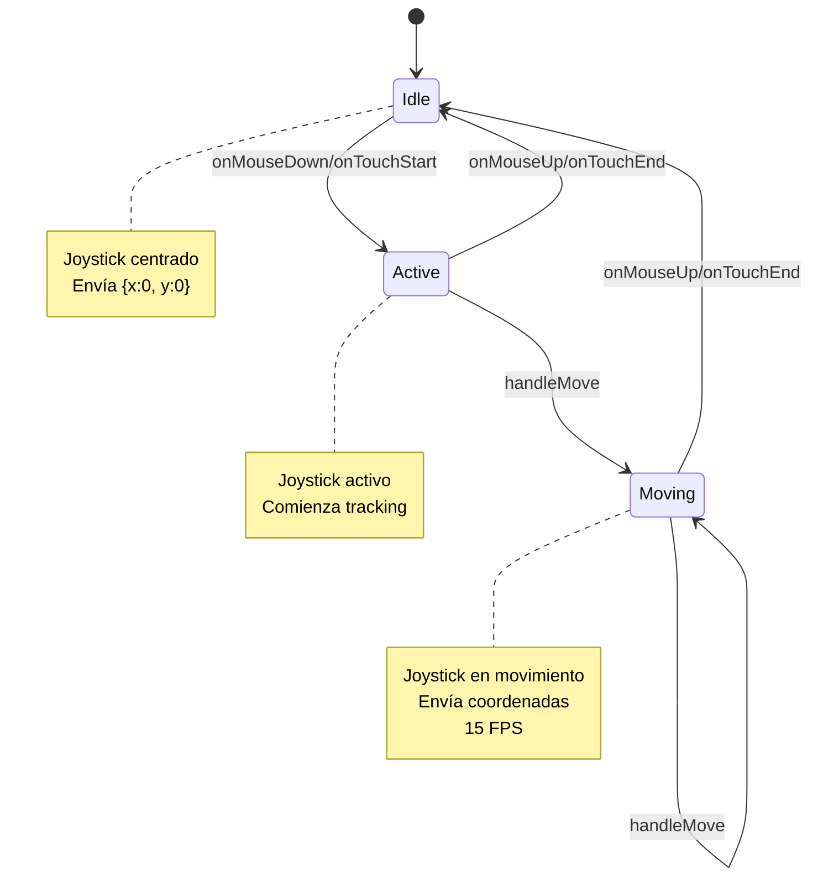
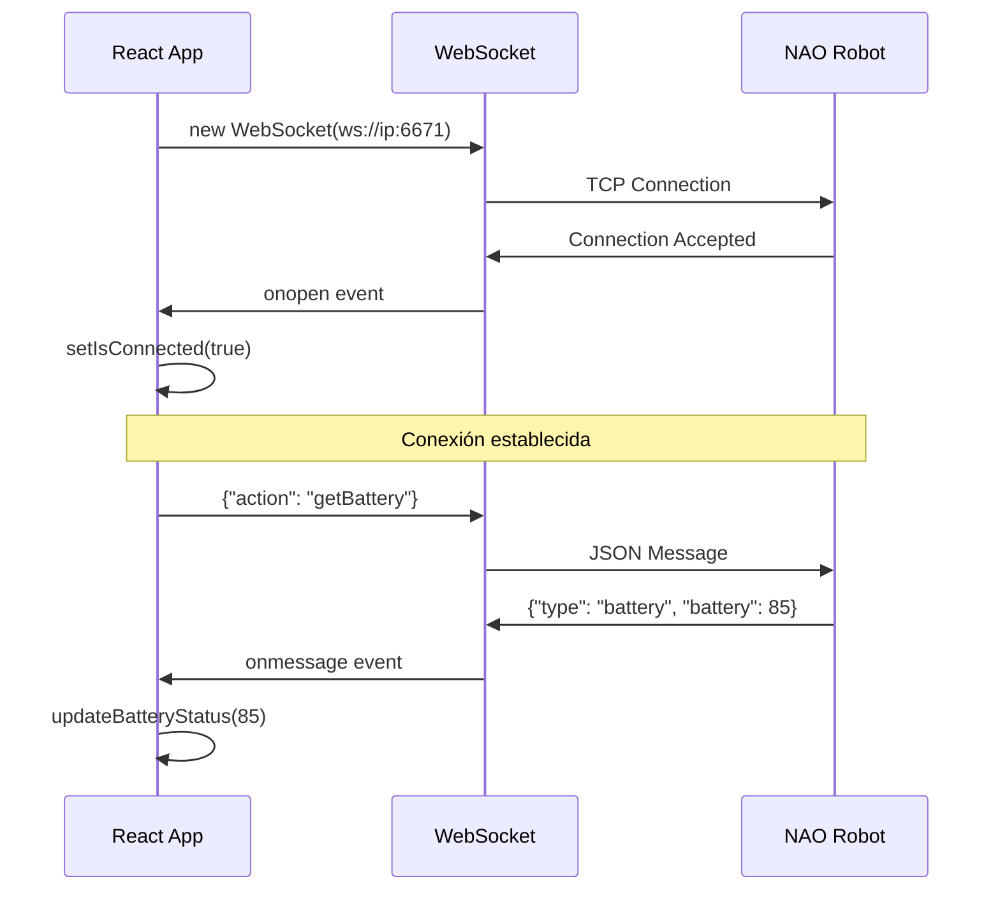
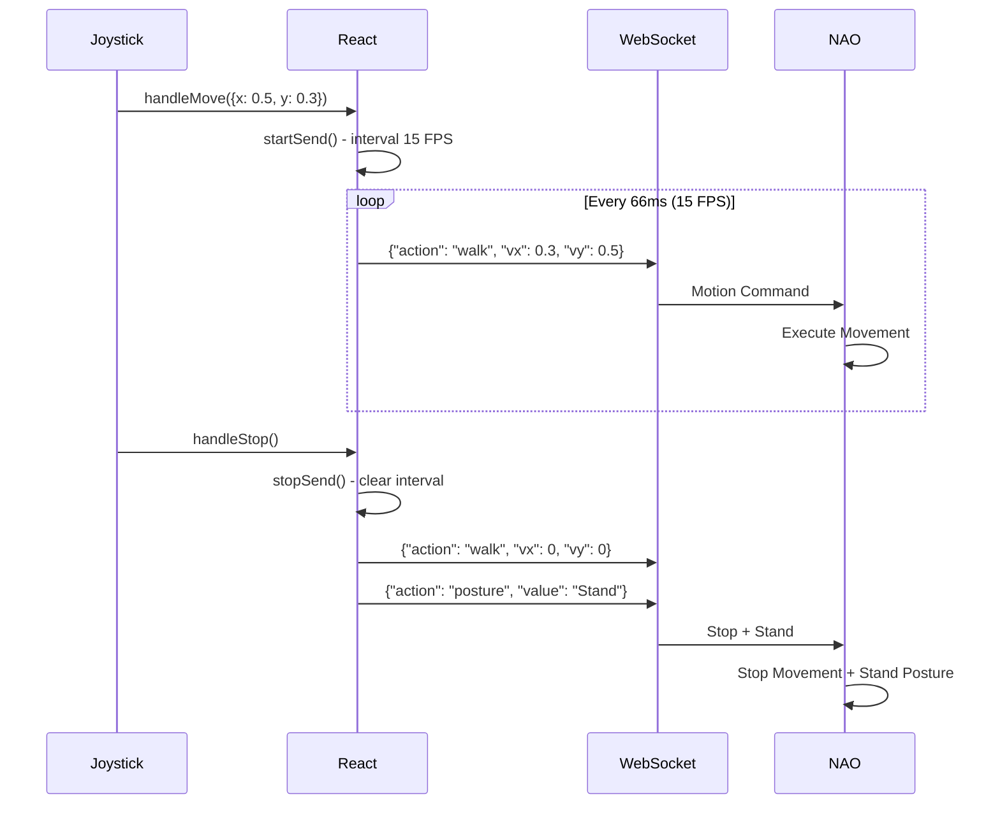
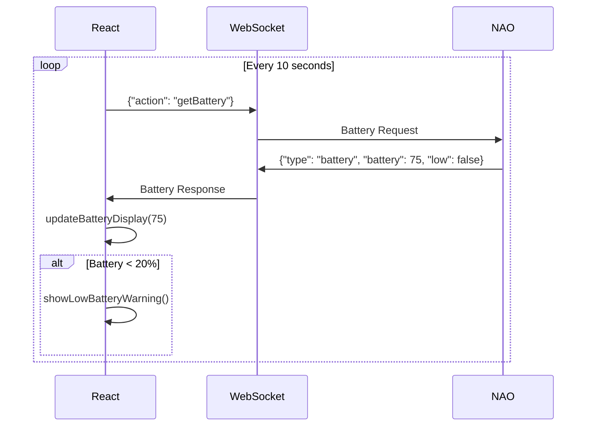

# 🤖 NAO Control React - Documentación Completa

## 📋 Tabla de Contenidos
- [📖 Descripción General](#-descripción-general)
- [✨ Características Principales](#-características-principales)
- [🏗️ Arquitectura del Proyecto](#️-arquitectura-del-proyecto)
- [📂 Estructura Detallada de Componentes](#-estructura-detallada-de-componentes)
- [🔧 Hooks Personalizados](#-hooks-personalizados)
- [📡 Sistema de Comunicación WebSocket](#-sistema-de-comunicación-websocket)
- [🎮 Sistema de Control del Joystick](#-sistema-de-control-del-joystick)
- [🎛️ Modos de Control](#️-modos-de-control)
- [📱 Interfaz de Usuario](#-interfaz-de-usuario)
- [🔨 Instalación y Configuración](#-instalación-y-configuración)
- [⚙️ Configuración Avanzada](#️-configuración-avanzada)
- [🌐 Protocolo de Comunicación](#-protocolo-de-comunicación)
- [📊 Monitoreo y Estadísticas](#-monitoreo-y-estadísticas)
- [🚀 Despliegue](#-despliegue)
- [🧪 Testing](#-testing)
- [📚 Migración desde Vanilla JS](#-migración-desde-vanilla-js)
- [🤝 Contribución](#-contribución)

## 📖 Descripción General

**NAO Control React** es una aplicación web moderna construida con React 19 que proporciona una interfaz de control completa para robots NAO de SoftBank Robotics. Esta aplicación permite controlar remotamente el robot a través de una conexión WebSocket, ofreciendo una experiencia de usuario intuitiva y responsiva tanto en dispositivos móviles como de escritorio.

### 🎯 Propósito

La aplicación está diseñada para:
- Facilitar el control remoto de robots NAO en entornos educativos y de investigación
- Proporcionar una interfaz táctil optimizada para tablets y smartphones
- Permitir el monitoreo en tiempo real del estado del robot
- Ofrecer múltiples modalidades de control (caminata, brazos, cabeza)
- Integrar funciones avanzadas como control de voz, LEDs y cámara

### 🔧 Tecnologías Utilizadas

- **React 19.1.0**: Framework principal con hooks modernos
- **WebSocket API**: Comunicación en tiempo real con el robot
- **CSS3**: Diseño responsivo y animaciones
- **HTML5**: Estructura semántica y accesibilidad
- **JavaScript ES6+**: Lógica de aplicación moderna

## ✨ Características Principales

### 🎮 Control de Movimiento
- ✅ **Joystick Virtual Táctil**: Interfaz de joystick optimizada para touch con retroalimentación háptica
- ✅ **4 Modos de Control**: Caminata, brazo izquierdo, brazo derecho y cabeza
- ✅ **Control de Velocidad Variable**: Precisión en el control de movimientos
- ✅ **Auto-Stop Inteligente**: Detiene automáticamente el movimiento al soltar el joystick
- ✅ **Comandos de Postura**: Botones dedicados para Stand, Sit y Autonomous Life

### 🗣️ Sistema de Voz
- ✅ **Text-to-Speech**: Envío de texto para síntesis de voz
- ✅ **Soporte Multi-idioma**: Inglés, Francés, Alemán, Español, Italiano
- ✅ **Control de Volumen**: Ajuste del volumen del TTS (0-100%)
- ✅ **Configuración Persistente**: Guarda preferencias en localStorage

### 💡 Control de LEDs
- ✅ **4 Grupos de LEDs**: Pecho, Cara, Orejas, Ojos
- ✅ **Selector de Color RGB**: Paleta completa de colores
- ✅ **Control Individual**: Encender/apagar grupos independientemente
- ✅ **Vista Previa en Tiempo Real**: Visualización inmediata de cambios

### 📷 Sistema de Cámara
- ✅ **Stream en Vivo**: Visualización del feed MJPEG de la cámara del robot
- ✅ **Auto-detección de IP**: Configuración automática de la URL de cámara
- ✅ **Manejo de Errores**: Detección y recuperación de fallos de conexión
- ✅ **Interfaz Responsiva**: Adaptable a diferentes tamaños de pantalla

### 📊 Monitoreo del Robot
- ✅ **Estado de Batería**: Indicador visual con códigos de color
- ✅ **Estado de Conexión**: Monitoreo en tiempo real del WebSocket
- ✅ **Información del Sistema**: IP, estadísticas de articulaciones
- ✅ **Alertas Automáticas**: Notificaciones de batería baja/llena

### 🌐 Conectividad
- ✅ **WebSocket con Reconexión**: Reconexión automática cada 3 segundos
- ✅ **Protocolo JSON**: Mensajes estructurados y extensibles
- ✅ **Control de Tasa**: 15 FPS para comandos de movimiento continuo
- ✅ **Validación de Mensajes**: Verificación de integridad de datos

## 🏗️ Arquitectura del Proyecto

### 🔧 Principios de Diseño

La aplicación sigue una arquitectura **modular y basada en componentes** con los siguientes principios:

1. **Separación de Responsabilidades**: Cada componente tiene una función específica
2. **Composición sobre Herencia**: Uso de composición de componentes React
3. **Estado Reactivo**: Manejo de estado con React hooks y flujo unidireccional
4. **Hooks Personalizados**: Lógica reutilizable extraída en hooks específicos
5. **Responsive First**: Diseño mobile-first con adaptación a escritorio

### 📐 Patrón de Arquitectura

```
┌─────────────────────────────────────────────────────────────┐
│                        App.js                              │
│                   (Componente Raíz)                        │
└─────────────────────┬───────────────────────────────────────┘
                      │
┌─────────────────────▼───────────────────────────────────────┐
│                 NaoController.js                           │
│              (Componente Principal)                        │
│  • Estado global de la aplicación                         │
│  • Lógica de comunicación WebSocket                       │
│  • Coordinación entre componentes                         │
└─────┬─────────┬─────────┬─────────┬─────────┬─────────────┘
      │         │         │         │         │
      ▼         ▼         ▼         ▼         ▼
┌─────────┐ ┌─────────┐ ┌─────────┐ ┌─────────┐ ┌─────────────┐
│ModePanel│ │Joystick │ │Control  │ │SidePanel│ │Orientation  │
│         │ │         │ │Buttons  │ │         │ │Message      │
└─────────┘ └─────────┘ └─────────┘ └─────┬───┘ └─────────────┘
                                          │
                              ┌───────────▼───────────┐
                              │    MenuContent.js     │
                              │  (Contenedor Menús)   │
                              └─┬─────┬─────┬─────┬───┘
                                │     │     │     │
                                ▼     ▼     ▼     ▼
                          ┌─────────┬─────────┬─────────┬─────────┐
                          │VoiceMenu│CameraMenu│LedsMenu│StatsMenu│
                          └─────────┴─────────┴─────────┴─────────┘
```

### 🗂️ Estructura de Directorios

```
src/
├── components/              # Componentes React
│   ├── NaoController.js     # 🎛️ Controlador principal
│   ├── NaoController.css    # 🎨 Estilos del controlador
│   ├── Joystick.js          # 🕹️ Componente joystick
│   ├── Joystick.css         # 🎨 Estilos del joystick
│   ├── ModePanel.js         # 🔄 Panel selector de modos
│   ├── ModePanel.css        # 🎨 Estilos del panel de modos
│   ├── ControlButtons.js    # 🎮 Botones de control (Stand/Sit)
│   ├── ControlButtons.css   # 🎨 Estilos de botones de control
│   ├── SidePanel.js         # 📱 Panel lateral de navegación
│   ├── SidePanel.css        # 🎨 Estilos del panel lateral
│   ├── MenuContent.js       # 📋 Contenedor de menús
│   ├── MenuContent.css      # 🎨 Estilos del contenedor de menús
│   ├── VoiceMenu.js         # 🗣️ Menú de control de voz
│   ├── VoiceMenu.css        # 🎨 Estilos del menú de voz
│   ├── CameraMenu.js        # 📷 Menú de cámara
│   ├── CameraMenu.css       # 🎨 Estilos del menú de cámara
│   ├── LedsMenu.js          # 💡 Menú de control de LEDs
│   ├── LedsMenu.css         # 🎨 Estilos del menú de LEDs
│   ├── StatsMenu.js         # 📊 Menú de estadísticas
│   ├── StatsMenu.css        # 🎨 Estilos del menú de estadísticas
│   ├── LanguageMenu.js      # 🌐 Menú de configuración (idioma/volumen)
│   ├── LanguageMenu.css     # 🎨 Estilos del menú de configuración
│   ├── ExtrasNav.js         # 🧭 Navegación de extras
│   ├── ExtrasNav.css        # 🎨 Estilos de navegación
│   ├── OrientationMessage.js # 📱 Mensaje de orientación
│   └── OrientationMessage.css # 🎨 Estilos del mensaje de orientación
├── hooks/                   # React Hooks personalizados
│   ├── useWebSocket.js      # 🌐 Hook para WebSocket
│   └── useJoystick.js       # 🕹️ Hook para lógica del joystick
├── App.js                   # 🏠 Componente raíz de la aplicación
├── App.css                  # 🎨 Estilos globales de la aplicación
├── index.js                 # 🚀 Punto de entrada de React
└── index.css                # 🎨 Estilos base del HTML
```

## 📂 Estructura Detallada de Componentes

### 🎛️ NaoController.js (Componente Principal)

El **componente central** que orquesta toda la funcionalidad de la aplicación:

#### 📊 Estado del Componente
```javascript
const [currentMode, setCurrentMode] = useState('walk');        // Modo activo del joystick
const [activeMenu, setActiveMenu] = useState(null);           // Menú actualmente abierto
const [robotStats, setRobotStats] = useState({               // Estadísticas del robot
  ip: '',
  battery: 0,
  batteryLow: false,
  batteryFull: false,
  joints: []
});
const [hostIP, setHostIP] = useState('');                    // IP del host detectada
const [autonomousEnabled, setAutonomousEnabled] = useState(false); // Estado Autonomous Life
```

#### 🔄 Refs para Control
```javascript
const sendIntervalRef = useRef(null);                       // Intervalo para envío continuo (15 FPS)
const currentValuesRef = useRef({ x: 0, y: 0, mode: 'walk' }); // Valores actuales del joystick
```

#### 🎯 Funciones Principales
- **`sendCmd()`**: Envía comandos de movimiento según el modo activo
- **`startSend()` / `stopSend()`**: Controla el envío continuo de comandos
- **`handleJoystickMove()`**: Procesa movimientos del joystick
- **`handleStand()` / `handleSit()` / `handleAutonomous()`**: Comandos de postura
- **`handleMenuSelect()`**: Gestiona la navegación entre menús
- **`getBatteryIcon()` / `getBatteryColor()`**: Lógica de indicadores de batería

### 🕹️ Joystick.js

Componente que renderiza el joystick virtual y utiliza el hook `useJoystick`:

```javascript
const Joystick = ({ onMove, mode }) => {
  const {
    baseRef,      // Referencia al elemento base del joystick
    knobRef,      // Referencia al elemento knob (perilla)
    handleMouseDown,
    handleTouchStart
  } = useJoystick(onMove, mode);

  return (
    <div className="joy-wrapper">
      <div 
        className="joy-base"
        ref={baseRef}
        onMouseDown={handleMouseDown}
        onTouchStart={handleTouchStart}
      >
        <div className="joy-knob" ref={knobRef}></div>
      </div>
    </div>
  );
};
```

### 🔄 ModePanel.js

Panel de selección de modos de control:

```javascript
const ModePanel = ({ currentMode, onModeChange }) => {
  const modes = [
    { id: 'walk', icon: '🚶', label: 'Caminar' },
    { id: 'larm', icon: '🦾', label: 'Brazo Izq' },
    { id: 'rarm', icon: '🦾', label: 'Brazo Der' },
    { id: 'head', icon: '🗣️', label: 'Cabeza' }
  ];
  // ...renderizado de botones con estado activo
};
```

### 🎮 ControlButtons.js

Botones de control de postura:

```javascript
const ControlButtons = ({ onStand, onSit, onAutonomous, autonomousEnabled }) => {
  return (
    <div className="control-buttons">
      <button className="control-btn stand-btn" onClick={onStand}>
        🧍 Stand
      </button>
      <button className="control-btn sit-btn" onClick={onSit}>
        🪑 Sit
      </button>
      <button 
        className={`control-btn autonomous-btn ${autonomousEnabled ? 'active' : ''}`}
        onClick={onAutonomous}
      >
        🤖 Auto {autonomousEnabled ? 'ON' : 'OFF'}
      </button>
    </div>
  );
};
```

### 📱 SidePanel.js

Panel lateral de navegación y contenido de menús:

```javascript
const SidePanel = ({ 
  activeMenu, onMenuSelect, onSendVoice, onSetLed, onLedOff, 
  stats, onLanguageChange, onVolumeChange 
}) => {
  const menuItems = [
    { id: 'voice', icon: '🎤', label: 'Voz' },
    { id: 'camera', icon: '📷', label: 'Cámara' },
    { id: 'leds', icon: '💡', label: 'LEDs' },
    { id: 'stats', icon: '📊', label: 'Stats' },
    { id: 'lang', icon: '⚙️', label: 'Settings' }
  ];
  // ...renderizado de navegación y contenido
};
```

### 📋 MenuContent.js

Contenedor que renderiza el menú activo correspondiente:

```javascript
const MenuContent = ({ activeMenu, ...props }) => {
  const renderMenuContent = () => {
    switch (activeMenu) {
      case 'voice':
        return <VoiceMenu isEmbedded={true} {...props} />;
      case 'camera':
        return <CameraMenu isEmbedded={true} {...props} />;
      case 'leds':
        return <LedsMenu isEmbedded={true} {...props} />;
      case 'stats':
        return <StatsMenu isEmbedded={true} {...props} />;
      case 'lang':
        return <SettingsMenu isEmbedded={true} {...props} />;
      default:
        return null;
    }
  };
  // ...
};
```

### 🗣️ VoiceMenu.js

Control de texto a voz:

```javascript
const VoiceMenu = ({ onSendVoice, isEmbedded = false }) => {
  const [voiceText, setVoiceText] = useState('');

  const handleSend = () => {
    if (voiceText.trim()) {
      onSendVoice(voiceText);
      setVoiceText('');
    }
  };

  const handleKeyPress = (e) => {
    if (e.key === 'Enter' && e.ctrlKey) {
      handleSend();
    }
  };
  // ...textarea y botón de envío
};
```

### 📷 CameraMenu.js

Visualización del feed de cámara:

```javascript
const CameraMenu = ({ cameraUrl, isEmbedded = false }) => {
  const [currentCameraUrl, setCurrentCameraUrl] = useState('');
  const [imageError, setImageError] = useState(false);

  useEffect(() => {
    if (cameraUrl) {
      setCurrentCameraUrl(cameraUrl);
    } else {
      // Auto-detección de IP para construir URL de cámara
      const currentHost = window.location.hostname;
      const autoDetectedUrl = `http://${currentHost}:8080/video.mjpeg`;
      setCurrentCameraUrl(autoDetectedUrl);
    }
    setImageError(false);
  }, [cameraUrl]);
  // ...imagen con manejo de errores
};
```

### 💡 LedsMenu.js

Control de LEDs del robot:

```javascript
const LedsMenu = ({ onSetLed, onLedOff, isEmbedded = false }) => {
  const [selectedGroup, setSelectedGroup] = useState('ChestLeds');
  const [selectedColor, setSelectedColor] = useState('#ff0000');

  const ledGroups = [
    { value: 'ChestLeds', label: 'Pecho' },
    { value: 'FaceLeds', label: 'Cara' },
    { value: 'EarLeds', label: 'Orejas' },
    { value: 'EyeLeds', label: 'Ojos' }
  ];

  const handleSetLed = () => {
    const hex = selectedColor;
    const r = parseInt(hex.slice(1, 3), 16) / 255;
    const g = parseInt(hex.slice(3, 5), 16) / 255;
    const b = parseInt(hex.slice(5, 7), 16) / 255;
    onSetLed(selectedGroup, { r, g, b });
  };
  // ...selector de grupo, color y botones
};
```

### 📊 StatsMenu.js

Visualización de estadísticas del robot:

```javascript
const StatsMenu = ({ stats, isEmbedded = false }) => {
  return (
    <div className={isEmbedded ? 'menu embedded' : 'menu active'}>
      <header>
        <h3>📊 Estadísticas</h3>
      </header>
      
      <div className="stats-content">
        <div className="stat-item">
          <span className="stat-label">🌐 IP:</span>
          <span className="stat-value">{stats.ip || 'N/A'}</span>
        </div>
        
        <div className="stat-item">
          <span className="stat-label">🔋 Batería:</span>
          <span 
            className="stat-value" 
            style={{ color: stats.batteryColor }}
          >
            {stats.batteryIcon} {stats.battery || 'N/A'}%
          </span>
        </div>
        
        {stats.joints && stats.joints.length > 0 && (
          <div className="joints-section">
            <h4>🦾 Articulaciones</h4>
            {stats.joints.map((joint, index) => (
              <div key={index} className="joint-item">
                <span>{joint.name}</span>
                <span>{joint.position?.toFixed(2) || 'N/A'}</span>
                <span>{joint.temperature?.toFixed(1)}°C</span>
              </div>
            ))}
          </div>
        )}
      </div>
    </div>
  );
};
```

### 🌐 LanguageMenu.js (SettingsMenu)

Configuración de idioma y volumen:

```javascript
const SettingsMenu = ({ onLanguageChange, onVolumeChange, isEmbedded = false }) => {
  const [selectedLanguage, setSelectedLanguage] = useState(() => {
    return localStorage.getItem('nao-tts-language') || 'English';
  });
  
  const [volume, setVolume] = useState(() => {
    const savedVolume = localStorage.getItem('nao-volume');
    return savedVolume ? parseInt(savedVolume) : 50;
  });

  const languages = [
    { value: 'English', label: 'English' },
    { value: 'French', label: 'French' },
    { value: 'German', label: 'German' },
    { value: 'Spanish', label: 'Spanish' },
    { value: 'Italian', label: 'Italian' }
  ];

  const handleVolumeChange = (newVolume) => {
    setVolume(newVolume);
    localStorage.setItem('nao-volume', newVolume.toString());
    onVolumeChange(newVolume);
  };
  // ...controles de idioma y volumen
};
```

### 📱 OrientationMessage.js

Mensaje para rotar dispositivo en orientación portrait:

```javascript
const OrientationMessage = () => {
  return (
    <div className="orientation-message">
      <div className="orientation-content">
        <div className="rotate-icon">📱</div>
        <h2>Rota tu dispositivo</h2>
        <p>Para una mejor experiencia, por favor rota tu dispositivo a modo horizontal.</p>
      </div>
    </div>
  );
};
```

## 🔧 Hooks Personalizados

### 🌐 useWebSocket.js

Hook personalizado que maneja toda la lógica de comunicación WebSocket con el robot NAO:

#### 📋 Funcionalidades
- **Conexión automática** al inicializar el componente
- **Reconexión automática** cada 3 segundos si se pierde la conexión
- **Parsing automático** de mensajes JSON
- **Logging inteligente** (evita spam de comandos de movimiento)
- **Cleanup automático** al desmontar el componente

#### 🔧 Implementación
```javascript
const useWebSocket = (port = 6671) => {
  const [isConnected, setIsConnected] = useState(false);
  const [lastMessage, setLastMessage] = useState(null);
  const wsRef = useRef(null);
  const reconnectTimeoutRef = useRef(null);

  const connect = useCallback(() => {
    const host = window.location.hostname;
    const url = `ws://${host}:${port}`;
    
    console.log("[WS] Intentando conexión a", url);
    
    wsRef.current = new WebSocket(url);

    wsRef.current.onopen = () => {
      console.log("[WS] Conectado a", url);
      setIsConnected(true);
    };

    wsRef.current.onmessage = (evt) => {
      try {
        const msg = JSON.parse(evt.data);
        console.log("[WS] Msg recibido:", msg);
        setLastMessage(msg);
      } catch (e) {
        console.warn("[WS] JSON inválido:", evt.data);
      }
    };

    wsRef.current.onerror = (err) => {
      console.error("[WS] Error:", err);
    };

    wsRef.current.onclose = () => {
      console.warn("[WS] Desconectado. Reintentando en 3 s…");
      setIsConnected(false);
      reconnectTimeoutRef.current = setTimeout(connect, 3000);
    };
  }, [port]);

  const sendMessage = useCallback((message) => {
    if (wsRef.current && wsRef.current.readyState === WebSocket.OPEN) {
      try {
        wsRef.current.send(JSON.stringify(message));
        // Solo log para comandos que no sean de movimiento continuo
        if (message.action !== 'walk' && message.action !== 'move') {
          console.log("[WS] Enviado:", message);
        }
        return true;
      } catch (error) {
        console.error("[WS] Error enviando mensaje:", error);
        return false;
      }
    } else {
      console.warn("[WS] No conectado, mensaje no enviado:", message);
      return false;
    }
  }, []);

  // Cleanup automático
  useEffect(() => {
    connect();
    return () => {
      if (reconnectTimeoutRef.current) {
        clearTimeout(reconnectTimeoutRef.current);
      }
      if (wsRef.current) {
        wsRef.current.close();
      }
    };
  }, [connect]);

  return {
    isConnected,    // Boolean: estado de conexión
    lastMessage,    // Object: último mensaje recibido
    sendMessage,    // Function: enviar mensaje al robot
    connect,        // Function: reconectar manualmente
    disconnect      // Function: desconectar manualmente
  };
};
```

#### 📊 Estados del WebSocket
- **`CONNECTING (0)`**: Estableciendo conexión
- **`OPEN (1)`**: Conexión establecida y lista para comunicación
- **`CLOSING (2)`**: Cerrando conexión
- **`CLOSED (3)`**: Conexión cerrada

### 🕹️ useJoystick.js

Hook personalizado que implementa toda la lógica del joystick virtual táctil:

#### 📋 Funcionalidades
- **Soporte multi-touch**: Distingue entre diferentes toques simultáneos
- **Cálculo de límites**: Respeta los límites físicos del joystick
- **Normalización de valores**: Convierte posiciones pixel a valores [-1, 1]
- **Auto-centrado**: Retorna automáticamente al centro al soltar
- **Detección de umbral**: Ignora movimientos menores al 5% (reduce ruido)
- **Redimensionado dinámico**: Se adapta a cambios de tamaño de pantalla

#### 🔧 Implementación
```javascript
const useJoystick = (onMove, mode = 'walk') => {
  const [position, setPosition] = useState({ x: 0, y: 0 });
  const [isActive, setIsActive] = useState(false);
  const baseRef = useRef(null);
  const knobRef = useRef(null);
  const touchIdRef = useRef(null);
  const dimensionsRef = useRef({ R: 0, Rk: 0, LIM: 0 });

  // Recalcula dimensiones cuando cambia el tamaño
  const recalculateDimensions = useCallback(() => {
    if (baseRef.current && knobRef.current) {
      const R = baseRef.current.clientWidth / 2;      // Radio base
      const Rk = knobRef.current.clientWidth / 2;     // Radio knob
      const LIM = R - Rk;                             // Límite de movimiento
      dimensionsRef.current = { R, Rk, LIM };
    }
  }, []);

  // Posiciona el knob en coordenadas relativas
  const setKnobPosition = useCallback((dx, dy) => {
    if (knobRef.current) {
      knobRef.current.style.transform = 
        `translate(-50%, -50%) translate(${dx}px, ${dy}px)`;
    }
  }, []);

  // Centra el knob con animación
  const centerKnob = useCallback(() => {
    if (knobRef.current) {
      knobRef.current.style.transition = 'transform .1s';
      setKnobPosition(0, 0);
      setTimeout(() => {
        if (knobRef.current) {
          knobRef.current.style.transition = '';
        }
      }, 120);
    }
  }, [setKnobPosition]);

  // Procesa movimiento del joystick
  const handleMove = useCallback((clientX, clientY) => {
    if (!isActive || !baseRef.current) return;

    const rect = baseRef.current.getBoundingClientRect();
    const { R, LIM } = dimensionsRef.current;
    
    // Calcular desplazamiento desde el centro
    let dx = clientX - rect.left - R;
    let dy = clientY - rect.top - R;
    
    // Aplicar límites circulares
    const distance = Math.hypot(dx, dy);
    const factor = distance > LIM ? LIM / distance : 1;
    
    dx *= factor;
    dy *= factor;
    
    setKnobPosition(dx, dy);
    
    // Normalizar a [-1, 1] e invertir Y para coordenadas del robot
    const nx = dx / LIM;
    const ny = -dy / LIM;
    
    // Aplicar umbral de deadzone (5%)
    const vx = Math.abs(nx) > 0.05 ? nx : 0;
    const vy = Math.abs(ny) > 0.05 ? ny : 0;
    
    setPosition({ x: vx, y: vy });
    
    if (onMove) {
      onMove({ x: vx, y: vy, mode });
    }
  }, [isActive, onMove, mode, setKnobPosition]);

  // Eventos de mouse
  const handleMouseDown = useCallback((e) => {
    e.preventDefault();
    setIsActive(true);
    recalculateDimensions();
    handleMove(e.clientX, e.clientY);
  }, [handleMove, recalculateDimensions]);

  // Eventos táctiles
  const handleTouchStart = useCallback((e) => {
    e.preventDefault();
    if (e.touches.length > 0) {
      const touch = e.touches[0];
      setIsActive(true);
      touchIdRef.current = touch.identifier;
      recalculateDimensions();
      handleMove(touch.clientX, touch.clientY);
    }
  }, [handleMove, recalculateDimensions]);

  // Detener movimiento
  const stopMove = useCallback(() => {
    setIsActive(false);
    touchIdRef.current = null;
    centerKnob();
    setPosition({ x: 0, y: 0 });
    
    if (onMove) {
      onMove({ x: 0, y: 0, mode, isStop: true });
    }
  }, [centerKnob, onMove, mode]);

  // Event listeners globales
  useEffect(() => {
    const handleWindowMouseMove = (e) => {
      if (isActive) handleMove(e.clientX, e.clientY);
    };
    
    const handleWindowMouseUp = () => {
      if (isActive) stopMove();
    };
    
    const handleWindowTouchMove = (e) => {
      if (!isActive) return;
      
      for (let i = 0; i < e.touches.length; i++) {
        const touch = e.touches[i];
        if (touch.identifier === touchIdRef.current) {
          handleMove(touch.clientX, touch.clientY);
          break;
        }
      }
    };
    
    const handleWindowTouchEnd = () => {
      if (isActive) stopMove();
    };

    window.addEventListener('mousemove', handleWindowMouseMove);
    window.addEventListener('mouseup', handleWindowMouseUp);
    window.addEventListener('touchmove', handleWindowTouchMove, { passive: false });
    window.addEventListener('touchend', handleWindowTouchEnd);

    return () => {
      window.removeEventListener('mousemove', handleWindowMouseMove);
      window.removeEventListener('mouseup', handleWindowMouseUp);
      window.removeEventListener('touchmove', handleWindowTouchMove);
      window.removeEventListener('touchend', handleWindowTouchEnd);
    };
  }, [handleMove, stopMove, isActive]);

  // Listener para redimensionado
  useEffect(() => {
    recalculateDimensions();
    const handleResize = () => recalculateDimensions();
    window.addEventListener('resize', handleResize);
    return () => window.removeEventListener('resize', handleResize);
  }, [recalculateDimensions]);

  return {
    baseRef,          // Ref para el elemento base del joystick
    knobRef,          // Ref para el knob del joystick
    position,         // Posición actual normalizada {x, y}
    isActive,         // Boolean: si el joystick está siendo usado
    handleMouseDown,  // Handler para mouse down
    handleTouchStart  // Handler para touch start
  };
};
```

#### 📊 Coordenadas y Transformaciones
```
Coordenadas del Joystick:
┌─────────────────────┐
│  (-1,1)    (1,1)    │
│     ┌───────┐       │
│  ┌──┤   ●   ├──┐    │  ● = Centro (0,0)
│  │  └───────┘  │    │
│  (-1,0)   (1,0)     │
│     ┌───────┐       │
│  (-1,-1)  (1,-1)    │
└─────────────────────┘

Mapeo a Comandos NAO:
• X positivo = Movimiento lateral derecho
• X negativo = Movimiento lateral izquierdo  
• Y positivo = Movimiento hacia adelante
• Y negativo = Movimiento hacia atrás
```

## 📡 Sistema de Comunicación WebSocket

### 🔄 Flujo de Comunicación

```
┌─────────────────┐    WebSocket     ┌─────────────────┐
│   React App     │◄────────────────►│   NAO Robot     │
│   (Port 3000)   │   Port 6671      │  (Python Server)│
└─────────────────┘                  └─────────────────┘
         │                                     │
         ▼                                     ▼
┌─────────────────┐                  ┌─────────────────┐
│   JSON Messages │                  │  NAOqi Commands │
│   • walk        │                  │  • motion.move  │
│   • move        │                  │  • posture.*    │
│   • posture     │                  │  • tts.say      │
│   • say         │                  │  • leds.fadeRGB │
│   • led         │                  │  • battery.*    │
│   • language    │                  │  • camera.*     │
│   • volume      │                  │  └─────────────┘
│   • getBattery  │                           
└─────────────────┘                           
```

### 📤 Protocolo de Mensajes Enviados

#### 🚶 Comandos de Movimiento
```javascript
// Caminata (modo walk)
{
  action: 'walk',
  vx: 0.5,      // Velocidad adelante/atrás [-1.0, 1.0]
  vy: 0.2,      // Velocidad lateral [-1.0, 1.0]  
  wz: 0         // Velocidad rotacional (no usado)
}

// Movimiento de articulaciones (brazos/cabeza)
{
  action: 'move',
  joint: 'HeadYaw',     // Nombre de la articulación
  value: 0.3            // Valor angular [-1.0, 1.0]
}
```

#### 🧍 Comandos de Postura
```javascript
// Postura Stand
{
  action: 'posture',
  value: 'Stand'
}

// Postura Sit  
{
  action: 'posture',
  value: 'Sit'
}

// Autonomous Life
{
  action: 'autonomous',
  enable: true          // true para activar, false para desactivar
}
```

#### 🗣️ Comandos de Voz
```javascript
// Text-to-Speech
{
  action: 'say',
  text: 'Hola mundo'    // Texto a sintetizar
}

// Cambio de idioma TTS
{
  action: 'language',
  value: 'Spanish'      // 'English', 'French', 'German', 'Spanish', 'Italian'
}

// Control de volumen
{
  action: 'volume',
  value: 75             // Volumen [0-100]
}
```

#### 💡 Comandos de LEDs
```javascript
// Encender LEDs con color RGB
{
  action: 'led',
  group: 'ChestLeds',   // 'ChestLeds', 'FaceLeds', 'EarLeds', 'EyeLeds'
  r: 1.0,               // Componente rojo [0.0-1.0]
  g: 0.0,               // Componente verde [0.0-1.0]
  b: 0.0                // Componente azul [0.0-1.0]
}

// Apagar LEDs (enviando r=0, g=0, b=0)
{
  action: 'led',
  group: 'ChestLeds',
  r: 0,
  g: 0,
  b: 0
}
```

#### 📊 Comandos de Estado  
```javascript
// Solicitar estado de batería
{
  action: 'getBattery'
}
```

### 📥 Protocolo de Mensajes Recibidos

#### 🔋 Información de Batería
```javascript
{
  battery: 85,          // Porcentaje de batería [0-100]
  low: false,           // true si batería < 20%
  full: false           // true si batería > 95%
}
```

#### 📊 Estadísticas del Robot
```javascript
{
  type: 'stats',
  data: {
    ip: '192.168.1.100',                    // IP del robot
    battery: 85,                            // Porcentaje de batería
    joints: [                               // Array de articulaciones
      {
        name: 'HeadYaw',                    // Nombre de la articulación
        position: 0.1,                      // Posición actual (radianes)
        temperature: 35.2                   // Temperatura (°C)
      },
      {
        name: 'LShoulderPitch', 
        position: -0.5,
        temperature: 32.8
      }
      // ... más articulaciones
    ]
  }
}
```

### ⚡ Optimizaciones de Rendimiento

#### 🎯 Control de Tasa de Envío (15 FPS)
```javascript
// En NaoController.js
const startSend = useCallback(() => {
  if (!sendIntervalRef.current) {
    sendIntervalRef.current = setInterval(sendCmd, 1000 / 15); // 15 FPS
  }
}, [sendCmd]);
```

#### 🔇 Filtrado de Logs
```javascript
// En useWebSocket.js
const sendMessage = useCallback((message) => {
  if (wsRef.current && wsRef.current.readyState === WebSocket.OPEN) {
    try {
      wsRef.current.send(JSON.stringify(message));
      // Solo log para comandos que no sean de movimiento continuo
      if (message.action !== 'walk' && message.action !== 'move') {
        console.log("[WS] Enviado:", message);
      }
      return true;
    } catch (error) {
      console.error("[WS] Error enviando mensaje:", error);
      return false;
    }
  }
}, []);
```

#### 🔄 Reconexión Inteligente
```javascript
wsRef.current.onclose = () => {
  console.warn("[WS] Desconectado. Reintentando en 3 s…");
  setIsConnected(false);
  reconnectTimeoutRef.current = setTimeout(connect, 3000);
};
```
## 🎮 Sistema de Control del Joystick

### 🕹️ Funcionalidades del Joystick

El joystick virtual es el componente central para el control de movimiento del robot NAO:

#### 📱 Características Técnicas
- **Multi-touch**: Soporta tanto mouse como eventos táctiles
- **Límites circulares**: Respeta los límites físicos del joystick
- **Auto-centrado**: Regresa automáticamente al centro al soltar
- **Deadzone**: Ignora movimientos menores al 5% para evitar ruido
- **Responsive**: Se adapta a diferentes tamaños de pantalla
- **Feedback visual**: Animaciones suaves y transiciones

#### 🎯 Cálculo de Coordenadas

```javascript
// Transformación de píxeles a coordenadas normalizadas
const handleMove = (clientX, clientY) => {
  const rect = baseRef.current.getBoundingClientRect();
  const { R, LIM } = dimensionsRef.current;
  
  // Calcular desplazamiento desde el centro
  let dx = clientX - rect.left - R;
  let dy = clientY - rect.top - R;
  
  // Aplicar límites circulares
  const distance = Math.hypot(dx, dy);
  const factor = distance > LIM ? LIM / distance : 1;
  
  dx *= factor;
  dy *= factor;
  
  // Normalizar a [-1, 1] e invertir Y
  const nx = dx / LIM;
  const ny = -dy / LIM;  // Invertir Y para coordenadas del robot
  
  // Aplicar deadzone del 5%
  const vx = Math.abs(nx) > 0.05 ? nx : 0;
  const vy = Math.abs(ny) > 0.05 ? ny : 0;
  
  onMove({ x: vx, y: vy, mode });
};
```

#### 🔄 Estados del Joystick



## 🎛️ Modos de Control

### 🚶 Modo Walk (Caminata)

**Función**: Control de movimiento locomotor del robot

#### 📋 Características
- **Mapeo de ejes**:
  - X del joystick → Velocidad lateral (vy en NAO)
  - Y del joystick → Velocidad adelante/atrás (vx en NAO)
- **Auto-Stop**: Al soltar el joystick, envía comando de parada y postura Stand
- **Rango de velocidad**: [-1.0, 1.0] m/s aproximadamente

#### 🔧 Implementación
```javascript
case 'walk':
  // Para walk: adelante = vy local; lateral = vx local
  sendMessage({ action: 'walk', vx: vy, vy: vx, wz: 0 });
  break;
```

#### 🛑 Lógica de Parada
```javascript
const stopSend = useCallback(() => {
  if (sendIntervalRef.current) {
    clearInterval(sendIntervalRef.current);
    sendIntervalRef.current = null;
  }

  const { mode } = currentValuesRef.current;
  
  if (mode === 'walk') {
    // 1) Detener movimiento
    currentValuesRef.current = { x: 0, y: 0, mode };
    if (sendMessage) {
      sendMessage({ action: 'walk', vx: 0, vy: 0, wz: 0 });
      console.log('[JOY] walk STOP');
      
      // 2) Volver a Stand
      sendMessage({ action: 'posture', value: 'Stand' });
      console.log('[JOY] STAND enviado tras parada');
    }
  }
}, [sendMessage]);
```

### 🦾 Modo Left Arm (Brazo Izquierdo)

**Función**: Control del brazo izquierdo del robot

#### 📋 Características
- **Articulaciones controladas**:
  - X del joystick → `LShoulderRoll` (rotación lateral)
  - Y del joystick → `LShoulderPitch` (elevación)
- **Hold Position**: Al soltar, mantiene la posición actual
- **Rango angular**: Aproximadamente [-2.0, 2.0] radianes

#### 🔧 Implementación
```javascript
case 'larm':
  sendMessage({ action: 'move', joint: 'LShoulderPitch', value: vy });
  sendMessage({ action: 'move', joint: 'LShoulderRoll', value: vx });
  break;
```

### 🦾 Modo Right Arm (Brazo Derecho)

**Función**: Control del brazo derecho del robot

#### 📋 Características
- **Articulaciones controladas**:
  - X del joystick → `RShoulderRoll` (rotación lateral)
  - Y del joystick → `RShoulderPitch` (elevación)
- **Hold Position**: Al soltar, mantiene la posición actual
- **Simetría**: Comportamiento espejo del brazo izquierdo

#### 🔧 Implementación
```javascript
case 'rarm':
  sendMessage({ action: 'move', joint: 'RShoulderPitch', value: vy });
  sendMessage({ action: 'move', joint: 'RShoulderRoll', value: vx });
  break;
```

### 🗣️ Modo Head (Cabeza)

**Función**: Control de la cabeza del robot

#### 📋 Características
- **Articulaciones controladas**:
  - X del joystick → `HeadYaw` (rotación horizontal)
  - Y del joystick → `HeadPitch` (inclinación vertical)
- **Hold Position**: Al soltar, mantiene la posición actual
- **Seguimiento suave**: Movimientos precisos para seguimiento de objetivos

#### 🔧 Implementación
```javascript
case 'head':
  sendMessage({ action: 'move', joint: 'HeadPitch', value: vy });
  sendMessage({ action: 'move', joint: 'HeadYaw', value: vx });
  break;
```

### 🔄 Cambio de Modos

#### 🖱️ Interfaz de Selección
```javascript
const ModePanel = ({ currentMode, onModeChange }) => {
  const modes = [
    { id: 'walk', icon: '🚶', label: 'Caminar' },
    { id: 'larm', icon: '🦾', label: 'Brazo Izq' },
    { id: 'rarm', icon: '🦾', label: 'Brazo Der' },
    { id: 'head', icon: '🗣️', label: 'Cabeza' }
  ];

  return (
    <div className="mode-panel">
      {modes.map(mode => (
        <button
          key={mode.id}
          className={`mode-btn ${currentMode === mode.id ? 'active' : ''}`}
          onClick={() => onModeChange(mode.id)}
        >
          <span className="mode-icon">{mode.icon}</span>
          <span className="mode-label">{mode.label}</span>
        </button>
      ))}
    </div>
  );
};
```

#### 🔧 Lógica de Cambio
```javascript
const handleModeChange = useCallback((mode) => {
  setCurrentMode(mode);
  console.log('[MODE] Cambiado a', mode);
}, []);
```

## 📱 Interfaz de Usuario

### 🎨 Sistema de Diseño

#### 🎨 Paleta de Colores
```css
:root {
  /* Colores principales */
  --primary-bg: #1a1a1a;           /* Fondo principal oscuro */
  --secondary-bg: #2a2a2a;         /* Fondo secundario */
  --accent-color: #4CAF50;         /* Verde de acento (éxito) */
  --warning-color: #FFC107;        /* Amarillo de advertencia */
  --error-color: #FF5722;          /* Rojo de error */
  
  /* Componentes específicos */
  --joy-base: #333;                /* Fondo del joystick */
  --joy-knob: linear-gradient(145deg, #555, #777); /* Perilla del joystick */
  --menu-bg: rgba(0,0,0,.95);      /* Fondo de menús overlay */
  --light-gray: #ddd;              /* Gris claro para botones */
  
  /* Texto */
  --text-primary: #ffffff;         /* Texto principal */
  --text-secondary: #cccccc;       /* Texto secundario */
  --text-muted: #999999;           /* Texto apagado */
}
```

#### 📐 Sistema de Espaciado
```css
/* Espaciado base: 0.5rem = 8px */
--spacing-xs: 0.25rem;    /* 4px */
--spacing-sm: 0.5rem;     /* 8px */
--spacing-md: 1rem;       /* 16px */
--spacing-lg: 1.5rem;     /* 24px */
--spacing-xl: 2rem;       /* 32px */
--spacing-xxl: 3rem;      /* 48px */
```

#### 🔤 Tipografía
```css
/* Tamaños de fuente responsivos */
font-size: clamp(14px, 4vw, 18px);     /* Texto base */
font-size: clamp(16px, 5vw, 24px);     /* Títulos */
font-size: clamp(12px, 3vw, 14px);     /* Texto pequeño */
```

### 📱 Diseño Responsivo

#### 📐 Breakpoints
```css
/* Mobile First Approach */
/* Extra Small: < 576px (móviles) */
@media (max-width: 575.98px) {
  .joy-base {
    width: clamp(100px, 35vw, 150px);
    height: clamp(100px, 35vw, 150px);
  }
}

/* Small: 576px - 767.98px (móviles grandes) */
@media (min-width: 576px) and (max-width: 767.98px) {
  .joy-base {
    width: clamp(120px, 40vw, 180px);
    height: clamp(120px, 40vw, 180px);
  }
}

/* Medium: 768px - 991.98px (tablets) */
@media (min-width: 768px) and (max-width: 991.98px) {
  .joy-base {
    width: clamp(150px, 30vw, 200px);
    height: clamp(150px, 30vw, 200px);
  }
}

/* Large: 992px+ (escritorio) */
@media (min-width: 992px) {
  .joy-base {
    width: 200px;
    height: 200px;
  }
}
```

#### 🔄 Orientación
```css
/* Landscape (horizontal) - Interfaz principal */
@media (orientation: landscape) {
  .nao-controller {
    display: flex;
    flex-direction: row;
  }
  
  .side-panel {
    width: 300px;
    height: 100vh;
  }
  
  .main-content {
    flex: 1;
    padding: 1rem;
  }
}

/* Portrait (vertical) - Mensaje de rotación */
@media (orientation: portrait) {
  .orientation-message {
    display: flex;
    position: fixed;
    top: 0;
    left: 0;
    width: 100%;
    height: 100%;
    background: var(--primary-bg);
    align-items: center;
    justify-content: center;
    z-index: 9999;
  }
  
  .nao-controller {
    display: none;
  }
}
```

### 🎯 Layout Principal

#### 🏗️ Estructura CSS Grid/Flexbox
```css
.nao-controller {
  display: flex;
  height: 100vh;
  width: 100vw;
  background: var(--primary-bg);
  color: var(--text-primary);
  overflow: hidden;
}

.side-panel {
  width: 300px;
  background: var(--secondary-bg);
  display: flex;
  flex-direction: column;
  border-right: 1px solid #444;
}

.main-content {
  flex: 1;
  display: flex;
  align-items: center;
  justify-content: center;
  padding: 1rem;
}

.nes-pad {
  display: flex;
  flex-direction: column;
  align-items: center;
  gap: 1.5rem;
  max-width: 400px;
  width: 100%;
}
```

#### 🎮 Layout del Joystick
```css
.joy-wrapper {
  display: flex;
  justify-content: center;
  padding: 1rem;
}

.joy-base {
  position: relative;
  width: clamp(120px, 40vw, 200px);
  height: clamp(120px, 40vw, 200px);
  background: var(--joy-base);
  border-radius: 50%;
  box-shadow: inset 0 -0.5rem 1rem rgba(0,0,0,0.6);
  touch-action: none;
  cursor: pointer;
}

.joy-knob {
  position: absolute;
  left: 50%;
  top: 50%;
  width: clamp(50px, 15vw, 80px);
  height: clamp(50px, 15vw, 80px);
  background: var(--joy-knob);
  border-radius: 50%;
  transform: translate(-50%, -50%);
  transition: transform 0.1s cubic-bezier(0.25, 0.46, 0.45, 0.94);
  box-shadow: 
    0 0.2rem 0.5rem rgba(0,0,0,0.6),
    inset 0 -0.2rem 0.2rem rgba(255,255,255,0.1);
  pointer-events: none;
}
```

### 🎨 Componentes de UI

#### 🔘 Botones
```css
.control-btn, .mode-btn, .menu-btn {
  background: var(--light-gray);
  color: #222;
  border: none;
  padding: 0.75rem 1rem;
  border-radius: 0.3rem;
  font-size: 1rem;
  cursor: pointer;
  transition: all 0.2s ease;
  user-select: none;
}

.control-btn:hover, .mode-btn:hover, .menu-btn:hover {
  filter: brightness(1.1);
  transform: translateY(-1px);
}

.control-btn:active, .mode-btn:active, .menu-btn:active {
  transform: translateY(0);
}

.control-btn.active, .mode-btn.active {
  background: var(--accent-color);
  color: white;
}
```

#### 📊 Indicadores de Estado
```css
.control-status {
  display: flex;
  justify-content: space-between;
  align-items: center;
  width: 100%;
  padding: 0.5rem 1rem;
  background: rgba(255,255,255,0.1);
  border-radius: 0.3rem;
  font-size: 0.9rem;
  margin-bottom: 1rem;
}

.status-connection {
  display: flex;
  align-items: center;
  gap: 0.5rem;
}

.status-battery {
  display: flex;
  align-items: center;
  gap: 0.25rem;
  font-weight: bold;
}
```

#### 🎭 Animaciones y Transiciones
```css
/* Animación del joystick */
@keyframes knob-pulse {
  0% { transform: translate(-50%, -50%) scale(1); }
  50% { transform: translate(-50%, -50%) scale(1.1); }
  100% { transform: translate(-50%, -50%) scale(1); }
}

.joy-knob:active {
  animation: knob-pulse 0.2s ease-in-out;
}

/* Transición de menús */
.menu {
  transition: transform 0.3s ease-in-out, opacity 0.3s ease-in-out;
}

.menu.active {
  transform: translateX(0);
  opacity: 1;
}

.menu:not(.active) {
  transform: translateX(-100%);
  opacity: 0;
}

/* Efectos hover */
.menu-nav-item:hover {
  background: rgba(255,255,255,0.1);
  transform: translateX(5px);
}
```

### 🌗 Accesibilidad

#### ♿ Características de Accesibilidad
- **Contraste**: Relación mínima 4.5:1 entre texto y fondo
- **Navegación por teclado**: Todos los elementos interactivos son focusables
- **Etiquetas semánticas**: Uso correcto de elementos HTML semánticos
- **ARIA labels**: Atributos ARIA para lectores de pantalla
- **Focus indicators**: Indicadores visuales claros para elementos enfocados

#### 🔧 Implementación
```css
/* Indicadores de foco */
.control-btn:focus,
.mode-btn:focus,
.menu-btn:focus {
  outline: 2px solid var(--accent-color);
  outline-offset: 2px;
}

/* Texto alternativo para iconos */
.mode-icon::after {
  content: attr(aria-label);
  position: absolute;
  left: -9999px;
}

/* Reducción de movimiento */
@media (prefers-reduced-motion: reduce) {
  .joy-knob,
  .menu,
  .control-btn {
    transition: none;
  }
  
  .joy-knob:active {
    animation: none;
  }
}
```

## 🔨 Instalación y Configuración

### 📋 Prerrequisitos

#### 🖥️ Sistema
- **Node.js**: Versión 14.0 o superior
- **npm**: Versión 6.0 o superior (incluido con Node.js)
- **Navegador moderno**: Chrome 80+, Firefox 75+, Safari 13+, Edge 80+

#### 🤖 Robot NAO
- **NAO Robot**: Versión 2.1 o superior
- **NAOqi**: Framework instalado y configurado
- **Servidor Python**: Servidor WebSocket ejecutándose en el puerto 6671
- **Red**: Robot y aplicación en la misma red local

### 🚀 Instalación Paso a Paso

#### 1️⃣ Clonar el Repositorio
```bash
# Clonar desde GitHub
git clone https://github.com/Limao0521/naoControl.git

# Navegar al directorio del proyecto React
cd naoControl/NaoControlReact
```

#### 2️⃣ Instalar Dependencias
```bash
# Instalar todas las dependencias npm
npm install
```

#### 3️⃣ Configuración del Entorno
```bash
# Crear archivo .env (opcional)
echo "REACT_APP_WEBSOCKET_PORT=6671" > .env
echo "REACT_APP_CAMERA_PORT=8080" >> .env
```

#### 4️⃣ Iniciar el Servidor de Desarrollo
```bash
# Iniciar la aplicación React
npm start
```

La aplicación se abrirá automáticamente en [http://localhost:3000](http://localhost:3000)

### ⚙️ Configuración Avanzada

#### 🌐 Configuración de WebSocket

**Archivo**: `src/components/NaoController.js`

```javascript
// Cambiar puerto del WebSocket (línea ~25)
const { sendMessage, lastMessage, isConnected } = useWebSocket(6671); // ← Cambiar aquí

// Para usar un host específico, modificar useWebSocket.js
const connect = useCallback(() => {
  const host = 'IP_ESPECIFICA'; // En lugar de window.location.hostname
  const url = `ws://${host}:${port}`;
  // ...
}, [port]);
```

#### 📷 Configuración de Cámara

**Archivo**: `src/components/CameraMenu.js`

```javascript
// Configuración automática (por defecto)
useEffect(() => {
  if (cameraUrl) {
    setCurrentCameraUrl(cameraUrl);
  } else {
    // Auto-detección de IP
    const currentHost = window.location.hostname;
    const autoDetectedUrl = `http://${currentHost}:8080/video.mjpeg`;
    setCurrentCameraUrl(autoDetectedUrl);
  }
  setImageError(false);
}, [cameraUrl]);

// Configuración manual estática
const STATIC_CAMERA_URL = 'http://192.168.1.100:8080/video.mjpeg';
```

#### 🎨 Personalización de Temas

**Archivo**: `src/index.css`

```css
:root {
  /* Tema Oscuro (por defecto) */
  --primary-bg: #1a1a1a;
  --secondary-bg: #2a2a2a;
  --text-primary: #ffffff;
  
  /* Tema Claro (opcional) */
  /* 
  --primary-bg: #f5f5f5;
  --secondary-bg: #ffffff;
  --text-primary: #333333;
  */
  
  /* Colores personalizados */
  --accent-color: #4CAF50;    /* Verde por defecto */
  --warning-color: #FFC107;   /* Amarillo */
  --error-color: #FF5722;     /* Rojo */
}
```

#### 📱 Configuración Responsiva

**Archivo**: `src/components/Joystick.css`

```css
/* Tamaños del joystick por dispositivo */
.joy-base {
  /* Móvil: 120px - 150px */
  width: clamp(120px, 40vw, 200px);
  height: clamp(120px, 40vw, 200px);
}

/* Para pantallas muy pequeñas */
@media (max-width: 480px) {
  .joy-base {
    width: clamp(100px, 35vw, 140px);
    height: clamp(100px, 35vw, 140px);
  }
}

/* Para tablets */
@media (min-width: 768px) and (max-width: 1024px) {
  .joy-base {
    width: clamp(150px, 25vw, 220px);
    height: clamp(150px, 25vw, 220px);
  }
}
```

### 🔧 Scripts Disponibles

```json
{
  "scripts": {
    "start": "react-scripts start",      // Servidor de desarrollo
    "build": "react-scripts build",      // Build de producción
    "test": "react-scripts test",        // Ejecutar tests
    "eject": "react-scripts eject",      // Exponer configuración
    "lint": "eslint src/**/*.js",        // Linter (opcional)
    "format": "prettier --write src/**/*.js" // Formatter (opcional)
  }
}
```

#### 🛠️ Scripts Personalizados (Opcional)

**Agregar al `package.json`**:

```json
{
  "scripts": {
    "dev": "npm start",
    "prod": "npm run build && serve -s build",
    "analyze": "npm run build && npx bundle-analyzer build/static/js/*.js",
    "clean": "rm -rf build node_modules && npm install",
    "deploy": "npm run build && scp -r build/* user@server:/var/www/nao-control/"
  }
}
```

### 🌐 Configuración de Red

#### 🏠 Red Local (Recomendado)

```
┌─────────────────┐    WiFi/Ethernet    ┌─────────────────┐
│  Computadora    │◄──────────────────►│   Router WiFi   │
│  (React App)    │   192.168.1.0/24   │                 │
│  192.168.1.10   │                     └─────────────────┘
└─────────────────┘                              │
                                                 │ WiFi
                                                 ▼
                                    ┌─────────────────┐
                                    │   NAO Robot     │
                                    │  192.168.1.100  │
                                    │  (WebSocket:6671)│
                                    │  (Camera:8080)  │
                                    └─────────────────┘
```

#### 🔗 Configuración de IP Estática

**En el robot NAO**:
```bash
# Conectar por SSH al robot
ssh nao@192.168.1.100

# Configurar IP estática
sudo nano /etc/network/interfaces

# Agregar configuración:
auto eth0
iface eth0 inet static
    address 192.168.1.100
    netmask 255.255.255.0
    gateway 192.168.1.1
    dns-nameservers 8.8.8.8
```

#### 🔥 Configuración de Firewall

**En la computadora (Windows)**:
```powershell
# Permitir puerto 3000 para React
netsh advfirewall firewall add rule name="React Dev Server" dir=in action=allow protocol=TCP localport=3000

# Permitir comunicación con NAO
netsh advfirewall firewall add rule name="NAO WebSocket" dir=out action=allow protocol=TCP remoteport=6671
netsh advfirewall firewall add rule name="NAO Camera" dir=out action=allow protocol=TCP remoteport=8080
```

**En la computadora (Linux/macOS)**:
```bash
# UFW (Ubuntu)
sudo ufw allow 3000/tcp
sudo ufw allow out 6671/tcp
sudo ufw allow out 8080/tcp

# iptables (genérico)
sudo iptables -A INPUT -p tcp --dport 3000 -j ACCEPT
sudo iptables -A OUTPUT -p tcp --dport 6671 -j ACCEPT
sudo iptables -A OUTPUT -p tcp --dport 8080 -j ACCEPT
```

### 📦 Dependencias del Proyecto

#### 📋 Dependencias Principales
```json
{
  "dependencies": {
    "react": "^19.1.0",                    // Framework principal
    "react-dom": "^19.1.0",               // DOM bindings
    "react-scripts": "5.0.1",             // Herramientas de desarrollo
    "web-vitals": "^2.1.4"                // Métricas de rendimiento
  }
}
```

#### 🧪 Dependencias de Desarrollo y Testing
```json
{
  "devDependencies": {
    "@testing-library/dom": "^10.4.0",      // Testing utilities
    "@testing-library/jest-dom": "^6.6.3",  // Jest matchers
    "@testing-library/react": "^16.3.0",    // React testing
    "@testing-library/user-event": "^13.5.0" // User interaction testing
  }
}
```

#### ➕ Dependencias Opcionales (Para añadir si es necesario)
```bash
# Para manejo de estado complejo
npm install @reduxjs/toolkit react-redux

# Para routing (si se añaden múltiples páginas)
npm install react-router-dom

# Para animaciones avanzadas
npm install framer-motion

# Para gráficos y charts
npm install recharts

# Para iconos
npm install react-icons

# Para utilidades CSS
npm install classnames

# Para formularios complejos
npm install react-hook-form

# Para fecha y hora
npm install date-fns
```

### 🔍 Troubleshooting Común

#### ❌ Error: "WebSocket connection failed"

**Posibles causas y soluciones**:

1. **Robot no conectado**:
   ```bash
   # Verificar ping al robot
   ping 192.168.1.100
   ```

2. **Servidor WebSocket no ejecutándose**:
   ```bash
   # Verificar puerto abierto
   telnet 192.168.1.100 6671
   ```

3. **Firewall bloqueando conexión**:
   ```bash
   # Deshabilitar temporalmente firewall para probar
   sudo ufw disable  # Linux
   # Windows: Panel de Control > Sistema y Seguridad > Firewall de Windows
   ```

#### ❌ Error: "Camera feed not loading"

**Soluciones**:

1. **Verificar URL de cámara**:
   ```javascript
   // Abrir en navegador directamente
   http://192.168.1.100:8080/video.mjpeg
   ```

2. **Problemas de CORS**:
   ```javascript
   // En CameraMenu.js, agregar proxy si es necesario
   const proxyUrl = '/api/camera-proxy';
   ```

3. **Cámara no iniciada en el robot**:
   ```python
   # En el servidor Python del robot
   camera = ALProxy("ALVideoDevice", ROBOT_IP, 9559)
   camera.startCamera()
   ```

#### ❌ Error: "npm start fails"

**Soluciones**:

1. **Limpiar caché de npm**:
   ```bash
   npm cache clean --force
   rm -rf node_modules package-lock.json
   npm install
   ```

2. **Problemas de versión de Node**:
   ```bash
   # Verificar versión
   node --version
   npm --version
   
   # Actualizar si es necesario
   npm install -g npm@latest
   ```

3. **Puerto 3000 ocupado**:
   ```bash
   # Linux/macOS
   lsof -ti:3000 | xargs kill -9
   
   # Windows
   netstat -ano | findstr :3000
   taskkill /PID <PID> /F
   ```

### 🚀 Despliegue

#### 🏗️ Build de Producción

```bash
# Crear build optimizado
npm run build

# El resultado estará en la carpeta 'build/'
ls -la build/
```

#### 🌐 Despliegue Estático

**Con servidor HTTP simple**:
```bash
# Instalar servidor estático
npm install -g serve

# Servir build de producción
serve -s build -p 3000
```

**Con Apache/Nginx**:
```bash
# Copiar archivos al servidor web
sudo cp -r build/* /var/www/html/nao-control/

# Configurar Apache virtual host
sudo nano /etc/apache2/sites-available/nao-control.conf
```

#### 📱 PWA (Progressive Web App)

**Para hacer la aplicación instalable**:

1. **Editar `public/manifest.json`**:
```json
{
  "short_name": "NAO Control",
  "name": "NAO Robot Control Interface",
  "icons": [
    {
      "src": "favicon.ico",
      "sizes": "64x64 32x32 24x24 16x16",
      "type": "image/x-icon"
    }
  ],
  "start_url": ".",
  "display": "standalone",
  "theme_color": "#000000",
  "background_color": "#ffffff"
}
```

2. **Registrar Service Worker** en `src/index.js`:
```javascript
// Descomentar para habilitar PWA
// serviceWorkerRegistration.register();
```

## ⚙️ Configuración Avanzada

### 🏗️ Configuración de Build

#### 📦 Optimización de Bundle

**Archivo**: `package.json`
```json
{
  "homepage": "/nao-control",  // Para subdirectorio
  "scripts": {
    "build": "GENERATE_SOURCEMAP=false react-scripts build",  // Sin source maps
    "build:analyze": "npm run build && npx bundle-analyzer build/static/js/*.js"
  }
}
```

#### 🚀 Variables de Entorno

**Archivo**: `.env`
```bash
# Puerto del servidor de desarrollo
PORT=3000

# Puerto WebSocket del robot
REACT_APP_WEBSOCKET_PORT=6671

# Puerto de cámara del robot
REACT_APP_CAMERA_PORT=8080

# IP del robot (opcional, usa auto-detección si no se especifica)
REACT_APP_ROBOT_IP=192.168.1.100

# Habilitar source maps en producción
GENERATE_SOURCEMAP=false

# Configuración de proxy para desarrollo
REACT_APP_PROXY_ENABLED=false
```

#### 🔧 Configuración de Proxy

**Para desarrollo con proxy**, crear `setupProxy.js`:
```javascript
const { createProxyMiddleware } = require('http-proxy-middleware');

module.exports = function(app) {
  // Proxy para WebSocket
  app.use(
    '/ws',
    createProxyMiddleware({
      target: 'ws://192.168.1.100:6671',
      ws: true,
      changeOrigin: true
    })
  );
  
  // Proxy para cámara
  app.use(
    '/camera',
    createProxyMiddleware({
      target: 'http://192.168.1.100:8080',
      changeOrigin: true,
      pathRewrite: {
        '^/camera': '/video.mjpeg'
      }
    })
  );
};
```

### 🎛️ Configuración de Componentes

#### 🕹️ Personalización del Joystick

**Archivo**: `src/hooks/useJoystick.js`
```javascript
// Configuraciones personalizables
const CONFIG = {
  DEADZONE: 0.05,           // Zona muerta (5%)
  SEND_RATE: 15,            // FPS de envío (15 Hz)
  AUTO_CENTER_SPEED: 120,   // Velocidad de auto-centrado (ms)
  BOUNDS_CHECK: true,       // Verificar límites circulares
  SMOOTH_MOVEMENT: true     // Movimiento suavizado
};
```

#### 🔋 Configuración de Monitoreo

**Archivo**: `src/components/NaoController.js`
```javascript
// Configuraciones de batería y monitoreo
const BATTERY_CONFIG = {
  LOW_THRESHOLD: 20,        // Batería baja (%)
  FULL_THRESHOLD: 95,       // Batería llena (%)
  UPDATE_INTERVAL: 10000,   // Intervalo de actualización (ms)
  WARNING_ENABLED: true     // Mostrar alertas
};

const CONNECTION_CONFIG = {
  RECONNECT_INTERVAL: 3000, // Intervalo de reconexión (ms)
  MAX_RETRIES: 10,          // Máximo intentos de reconexión
  TIMEOUT: 5000             // Timeout de conexión (ms)
};
```

#### 🎨 Temas Personalizados

**Crear sistema de temas**, agregar en `src/contexts/ThemeContext.js`:
```javascript
import React, { createContext, useContext, useState } from 'react';

const ThemeContext = createContext();

export const themes = {
  dark: {
    primary: '#1a1a1a',
    secondary: '#2a2a2a',
    accent: '#4CAF50',
    text: '#ffffff'
  },
  light: {
    primary: '#f5f5f5',
    secondary: '#ffffff',
    accent: '#2196F3',
    text: '#333333'
  },
  cyberpunk: {
    primary: '#0a0a0a',
    secondary: '#1a0033',
    accent: '#00ff41',
    text: '#00ff41'
  }
};

export const ThemeProvider = ({ children }) => {
  const [currentTheme, setCurrentTheme] = useState('dark');
  
  return (
    <ThemeContext.Provider value={{ currentTheme, setCurrentTheme, themes }}>
      {children}
    </ThemeContext.Provider>
  );
};

export const useTheme = () => useContext(ThemeContext);
```

## 🌐 Protocolo de Comunicación

### 📡 Especificación del Protocolo WebSocket

El protocolo de comunicación utiliza **WebSocket** sobre **TCP/IP** con mensajes en formato **JSON**. La comunicación es **bidireccional** y **asíncrona**.

#### 🔧 Configuración de Conexión
```javascript
// URL de conexión
ws://[HOST_IP]:6671

// Ejemplo
ws://192.168.1.100:6671
```

#### 📋 Formato de Mensaje Base
```json
{
  "action": "string",     // Tipo de comando
  "timestamp": "number",  // Timestamp opcional
  "id": "string"         // ID único opcional
}
```

### 📤 Comandos Salientes (React → NAO)

#### 🚶 Movimiento Locomotor
```json
{
  "action": "walk",
  "vx": 0.5,              // Velocidad adelante/atrás [-1.0, 1.0]
  "vy": 0.2,              // Velocidad lateral [-1.0, 1.0]
  "wz": 0.0               // Velocidad rotacional [-1.0, 1.0]
}
```

**Mapeo de Coordenadas**:
- `vx > 0`: Movimiento hacia adelante
- `vx < 0`: Movimiento hacia atrás  
- `vy > 0`: Movimiento lateral derecho
- `vy < 0`: Movimiento lateral izquierdo
- `wz > 0`: Rotación en sentido horario
- `wz < 0`: Rotación en sentido antihorario

#### 🦾 Movimiento de Articulaciones
```json
{
  "action": "move",
  "joint": "HeadYaw",     // Nombre de la articulación
  "value": 0.3            // Valor angular normalizado [-1.0, 1.0]
}
```

**Articulaciones Soportadas**:
- **Cabeza**: `HeadYaw`, `HeadPitch`
- **Brazo Izquierdo**: `LShoulderPitch`, `LShoulderRoll`, `LElbowYaw`, `LElbowRoll`
- **Brazo Derecho**: `RShoulderPitch`, `RShoulderRoll`, `RElbowYaw`, `RElbowRoll`
- **Piernas**: `LHipYawPitch`, `LHipRoll`, `LHipPitch`, `LKneePitch`, `LAnklePitch`, `LAnkleRoll`

#### 🧍 Comandos de Postura
```json
{
  "action": "posture",
  "value": "Stand"        // "Stand", "Sit", "Crouch", "LyingBack", "LyingBelly"
}
```

**Posturas Disponibles**:
- `Stand`: Posición de pie
- `Sit`: Sentado
- `Crouch`: Agachado
- `LyingBack`: Acostado boca arriba
- `LyingBelly`: Acostado boca abajo

#### 🤖 Control de Autonomous Life
```json
{
  "action": "autonomous",
  "enable": true          // true para activar, false para desactivar
}
```

#### 🗣️ Text-to-Speech
```json
{
  "action": "say",
  "text": "Hola mundo",   // Texto a sintetizar
  "language": "Spanish", // Idioma opcional
  "volume": 0.8         // Volumen opcional [0.0-1.0]
}
```

#### 🌐 Configuración de Idioma
```json
{
  "action": "language",
  "value": "Spanish"      // "English", "French", "German", "Spanish", "Italian"
}
```

#### 🔊 Control de Volumen
```json
{
  "action": "volume",
  "value": 75             // Volumen [0-100]
}
```

#### 💡 Control de LEDs
```json
{
  "action": "led",
  "group": "ChestLeds",   // Grupo de LEDs
  "r": 1.0,               // Componente roja [0.0-1.0]
  "g": 0.0,               // Componente verde [0.0-1.0]
  "b": 0.0,               // Componente azul [0.0-1.0]
  "duration": 0.5         // Duración de transición (opcional)
}
```

**Grupos de LEDs**:
- `ChestLeds`: LEDs del pecho
- `FaceLeds`: LEDs de la cara
- `EarLeds`: LEDs de las orejas
- `EyeLeds`: LEDs de los ojos
- `HeadLeds`: LEDs de la cabeza
- `LeftFootLeds`: LEDs del pie izquierdo
- `RightFootLeds`: LEDs del pie derecho

#### 📊 Solicitud de Estado
```json
{
  "action": "getBattery"  // Solicitar información de batería
}

{
  "action": "getStatus"   // Solicitar estado general
}

{
  "action": "getJoints"   // Solicitar estado de articulaciones
}
```

### 📥 Mensajes Entrantes (NAO → React)

#### 🔋 Estado de Batería
```json
{
  "type": "battery",
  "battery": 85,          // Porcentaje [0-100]
  "low": false,           // true si < 20%
  "full": false,          // true si > 95%
  "charging": false,      // true si está cargando
  "timestamp": 1640995200
}
```

#### 📊 Estadísticas Generales
```json
{
  "type": "stats",
  "data": {
    "ip": "192.168.1.100",
    "hostname": "nao-robot",
    "uptime": 3600,       // Segundos de funcionamiento
    "cpu_usage": 45.2,    // Porcentaje de CPU
    "memory_usage": 67.8, // Porcentaje de memoria
    "temperature": 42.5,  // Temperatura CPU (°C)
    "wifi_strength": -45, // Fuerza WiFi (dBm)
    "joints": [
      {
        "name": "HeadYaw",
        "position": 0.1,    // Posición actual (radianes)
        "temperature": 35.2,// Temperatura (°C)
        "stiffness": 1.0,   // Rigidez [0.0-1.0]
        "current": 0.15     // Corriente (A)
      }
    ]
  }
}
```

#### 👁️ Estado de Sensores
```json
{
  "type": "sensors",
  "data": {
    "sonar": {
      "left": 0.8,        // Distancia izquierda (m)
      "right": 1.2        // Distancia derecha (m)
    },
    "bumpers": {
      "left": false,      // Bumper izquierdo presionado
      "right": false      // Bumper derecho presionado
    },
    "touch": {
      "head": false,      // Sensor táctil cabeza
      "hands": {
        "left": false,    // Sensor mano izquierda
        "right": false    // Sensor mano derecha
      }
    },
    "accelerometer": {
      "x": 0.1,           // Aceleración X (m/s²)
      "y": 0.0,           // Aceleración Y (m/s²)
      "z": 9.8            // Aceleración Z (m/s²)
    },
    "gyroscope": {
      "x": 0.02,          // Velocidad angular X (rad/s)
      "y": -0.01,         // Velocidad angular Y (rad/s)
      "z": 0.0            // Velocidad angular Z (rad/s)
    }
  }
}
```

#### ❌ Mensajes de Error
```json
{
  "type": "error",
  "error": {
    "code": "MOTION_ERROR",
    "message": "No se pudo ejecutar el movimiento",
    "details": "Articulación bloqueada o robot caído",
    "timestamp": 1640995200
  }
}
```

#### ✅ Confirmaciones
```json
{
  "type": "ack",
  "action": "posture",    // Acción confirmada
  "status": "completed",  // "completed", "failed", "in_progress"
  "message": "Postura Stand ejecutada correctamente"
}
```

### 🔄 Flujo de Comunicación

#### 🚀 Secuencia de Conexión


#### 🕹️ Secuencia de Movimiento


#### 🔋 Secuencia de Monitoreo


### 🔐 Seguridad y Validación

#### 🛡️ Validación de Comandos
```javascript
// Validación en el lado React
const validateCommand = (command) => {
  // Validar estructura básica
  if (!command.action) {
    throw new Error('Missing action field');
  }
  
  // Validar rangos de valores
  if (command.action === 'walk') {
    if (Math.abs(command.vx) > 1.0 || Math.abs(command.vy) > 1.0) {
      throw new Error('Walk velocities must be in range [-1.0, 1.0]');
    }
  }
  
  // Validar tipos de datos
  if (command.action === 'volume') {
    if (!Number.isInteger(command.value) || command.value < 0 || command.value > 100) {
      throw new Error('Volume must be integer in range [0, 100]');
    }
  }
  
  return true;
};
```

#### 🔒 Rate Limiting
```javascript
// Control de tasa de envío
const rateLimiter = {
  walk: { maxRate: 15, lastSent: 0 },      // 15 FPS máximo
  move: { maxRate: 10, lastSent: 0 },      // 10 FPS máximo
  say: { maxRate: 1, lastSent: 0 },        // 1 por segundo
  led: { maxRate: 5, lastSent: 0 }         // 5 por segundo
};

const canSend = (action) => {
  const now = Date.now();
  const limit = rateLimiter[action];
  if (!limit) return true;
  
  const timeSince = now - limit.lastSent;
  const minInterval = 1000 / limit.maxRate;
  
  if (timeSince >= minInterval) {
    limit.lastSent = now;
    return true;
  }
  
  return false;
};
```

#### 🚨 Manejo de Errores
```javascript
// Manejo robusto de errores WebSocket
wsRef.current.onerror = (error) => {
  console.error('[WS] Error:', error);
  
  // Intentar reconexión inmediata
  if (wsRef.current.readyState === WebSocket.CLOSED) {
    setTimeout(connect, 1000);
  }
};

wsRef.current.onclose = (event) => {
  console.warn('[WS] Conexión cerrada:', event.code, event.reason);
  
  // Códigos de cierre estándar
  switch (event.code) {
    case 1000: // Cierre normal
      console.log('[WS] Cierre normal');
      break;
    case 1006: // Cierre anormal
      console.error('[WS] Cierre anormal - reconectando...');
      setTimeout(connect, 3000);
      break;
    default:
      console.error('[WS] Cierre inesperado:', event.code);
      setTimeout(connect, 3000);
  }
};
```

## 📊 Monitoreo y Estadísticas

### 📈 Métricas de Rendimiento

#### ⚡ Métricas de WebSocket
```javascript
const wsMetrics = {
  connected: false,
  connectionTime: null,
  messagessent: 0,
  messagesReceived: 0,
  reconnections: 0,
  lastLatency: 0,
  averageLatency: 0
};

// Medir latencia
const measureLatency = () => {
  const startTime = Date.now();
  sendMessage({ 
    action: 'ping', 
    timestamp: startTime 
  });
  
  // Respuesta esperada: { type: 'pong', timestamp: startTime }
};
```

#### 🎮 Métricas del Joystick
```javascript
const joystickMetrics = {
  totalMoves: 0,
  activeTime: 0,
  averageDistance: 0,
  maxDistance: 0,
  commandsSent: 0,
  fps: 0
};

// Calcular FPS real
let frameCount = 0;
let fpsStartTime = Date.now();

const updateFPS = () => {
  frameCount++;
  const elapsed = Date.now() - fpsStartTime;
  
  if (elapsed >= 1000) {
    joystickMetrics.fps = frameCount;
    frameCount = 0;
    fpsStartTime = Date.now();
  }
};
```

#### 🤖 Métricas del Robot
```javascript
const robotMetrics = {
  battery: {
    current: 0,
    history: [],
    drainRate: 0,
    estimatedTime: 0
  },
  joints: {
    temperatures: {},
    positions: {},
    stiffness: {}
  },
  system: {
    cpuUsage: 0,
    memoryUsage: 0,
    uptime: 0
  }
};

// Calcular tasa de descarga de batería
const calculateBatteryDrain = (newLevel) => {
  const now = Date.now();
  const history = robotMetrics.battery.history;
  
  history.push({ level: newLevel, timestamp: now });
  
  // Mantener solo últimos 10 registros
  if (history.length > 10) {
    history.shift();
  }
  
  // Calcular tasa de drenaje (% por hora)
  if (history.length >= 2) {
    const first = history[0];
    const last = history[history.length - 1];
    const timeDiff = (last.timestamp - first.timestamp) / 1000 / 3600; // horas
    const levelDiff = first.level - last.level; // %
    
    robotMetrics.battery.drainRate = levelDiff / timeDiff;
    robotMetrics.battery.estimatedTime = last.level / robotMetrics.battery.drainRate;
  }
};
```

### 📊 Componente de Estadísticas Avanzadas

#### 🎯 StatsMenu Extendido
```javascript
const AdvancedStatsMenu = ({ stats, metrics, isEmbedded = false }) => {
  const [selectedTab, setSelectedTab] = useState('robot');
  
  const formatUptime = (seconds) => {
    const hours = Math.floor(seconds / 3600);
    const minutes = Math.floor((seconds % 3600) / 60);
    return `${hours}h ${minutes}m`;
  };
  
  const formatBatteryTime = (hours) => {
    if (hours === Infinity || hours < 0) return 'N/A';
    return `${Math.floor(hours)}h ${Math.floor((hours % 1) * 60)}m`;
  };

  return (
    <div className={isEmbedded ? 'menu embedded' : 'menu active'}>
      <header>
        <h3>📊 Estadísticas Avanzadas</h3>
      </header>
      
      {/* Pestañas */}
      <div className="stats-tabs">
        <button 
          className={`tab-btn ${selectedTab === 'robot' ? 'active' : ''}`}
          onClick={() => setSelectedTab('robot')}
        >
          🤖 Robot
        </button>
        <button 
          className={`tab-btn ${selectedTab === 'connection' ? 'active' : ''}`}
          onClick={() => setSelectedTab('connection')}
        >
          🌐 Conexión
        </button>
        <button 
          className={`tab-btn ${selectedTab === 'performance' ? 'active' : ''}`}
          onClick={() => setSelectedTab('performance')}
        >
          ⚡ Rendimiento
        </button>
      </div>
      
      {/* Contenido según pestaña */}
      <div className="stats-content">
        {selectedTab === 'robot' && (
          <div className="robot-stats">
            <div className="stat-section">
              <h4>🔋 Batería</h4>
              <div className="stat-grid">
                <div className="stat-item">
                  <span className="stat-label">Nivel:</span>
                  <span className="stat-value">{stats.battery}%</span>
                </div>
                <div className="stat-item">
                  <span className="stat-label">Drenaje:</span>
                  <span className="stat-value">{metrics.battery.drainRate.toFixed(1)}%/h</span>
                </div>
                <div className="stat-item">
                  <span className="stat-label">Tiempo estimado:</span>
                  <span className="stat-value">{formatBatteryTime(metrics.battery.estimatedTime)}</span>
                </div>
              </div>
            </div>
            
            <div className="stat-section">
              <h4>🖥️ Sistema</h4>
              <div className="stat-grid">
                <div className="stat-item">
                  <span className="stat-label">CPU:</span>
                  <span className="stat-value">{metrics.system.cpuUsage}%</span>
                </div>
                <div className="stat-item">
                  <span className="stat-label">Memoria:</span>
                  <span className="stat-value">{metrics.system.memoryUsage}%</span>
                </div>
                <div className="stat-item">
                  <span className="stat-label">Uptime:</span>
                  <span className="stat-value">{formatUptime(metrics.system.uptime)}</span>
                </div>
              </div>
            </div>
            
            <div className="stat-section">
              <h4>🦾 Articulaciones Críticas</h4>
              <div className="joints-grid">
                {Object.entries(metrics.joints.temperatures).map(([joint, temp]) => (
                  <div key={joint} className="joint-stat">
                    <span className="joint-name">{joint}</span>
                    <span className={`joint-temp ${temp > 60 ? 'warning' : ''}`}>
                      {temp.toFixed(1)}°C
                    </span>
                  </div>
                ))}
              </div>
            </div>
          </div>
        )}
        
        {selectedTab === 'connection' && (
          <div className="connection-stats">
            <div className="stat-section">
              <h4>🌐 WebSocket</h4>
              <div className="stat-grid">
                <div className="stat-item">
                  <span className="stat-label">Estado:</span>
                  <span className={`stat-value ${stats.connected ? 'connected' : 'disconnected'}`}>
                    {stats.connected ? '🟢 Conectado' : '🔴 Desconectado'}
                  </span>
                </div>
                <div className="stat-item">
                  <span className="stat-label">Latencia:</span>
                  <span className="stat-value">{metrics.lastLatency}ms</span>
                </div>
                <div className="stat-item">
                  <span className="stat-label">Reconexiones:</span>
                  <span className="stat-value">{metrics.reconnections}</span>
                </div>
              </div>
            </div>
            
            <div className="stat-section">
              <h4>📊 Tráfico</h4>
              <div className="stat-grid">
                <div className="stat-item">
                  <span className="stat-label">Enviados:</span>
                  <span className="stat-value">{metrics.messagesS}</span>
                </div>
                <div className="stat-item">
                  <span className="stat-label">Recibidos:</span>
                  <span className="stat-value">{metrics.messagesReceived}</span>
                </div>
                <div className="stat-item">
                  <span className="stat-label">Ratio:</span>
                  <span className="stat-value">
                    {(metrics.messagesReceived / metrics.messagesSent * 100).toFixed(1)}%
                  </span>
                </div>
              </div>
            </div>
          </div>
        )}
        
        {selectedTab === 'performance' && (
          <div className="performance-stats">
            <div className="stat-section">
              <h4>🎮 Joystick</h4>
              <div className="stat-grid">
                <div className="stat-item">
                  <span className="stat-label">FPS:</span>
                  <span className="stat-value">{metrics.fps}</span>
                </div>
                <div className="stat-item">
                  <span className="stat-label">Comandos enviados:</span>
                  <span className="stat-value">{metrics.commandsSent}</span>
                </div>
                <div className="stat-item">
                  <span className="stat-label">Tiempo activo:</span>
                  <span className="stat-value">{formatUptime(metrics.activeTime / 1000)}</span>
                </div>
              </div>
            </div>
            
            <div className="stat-section">
              <h4>💻 Aplicación</h4>
              <div className="stat-grid">
                <div className="stat-item">
                  <span className="stat-label">Memoria usada:</span>
                  <span className="stat-value">
                    {(performance.memory?.usedJSHeapSize / 1048576 || 0).toFixed(1)} MB
                  </span>
                </div>
                <div className="stat-item">
                  <span className="stat-label">FPS de la app:</span>
                  <span className="stat-value">60</span>
                </div>
              </div>
            </div>
          </div>
        )}
      </div>
    </div>
  );
};
```

### 📈 Gráficos de Monitoreo

#### 📊 Componente de Gráfico Simple
```javascript
const BatteryChart = ({ batteryHistory }) => {
  const canvasRef = useRef(null);
  
  useEffect(() => {
    const canvas = canvasRef.current;
    const ctx = canvas.getContext('2d');
    const { width, height } = canvas;
    
    // Limpiar canvas
    ctx.clearRect(0, 0, width, height);
    
    if (batteryHistory.length < 2) return;
    
    // Configuración del gráfico
    const padding = 20;
    const graphWidth = width - 2 * padding;
    const graphHeight = height - 2 * padding;
    
    // Encontrar rango de datos
    const minLevel = Math.min(...batteryHistory.map(h => h.level));
    const maxLevel = Math.max(...batteryHistory.map(h => h.level));
    const levelRange = maxLevel - minLevel || 1;
    
    const minTime = batteryHistory[0].timestamp;
    const maxTime = batteryHistory[batteryHistory.length - 1].timestamp;
    const timeRange = maxTime - minTime || 1;
    
    // Dibujar ejes
    ctx.strokeStyle = '#555';
    ctx.lineWidth = 1;
    ctx.beginPath();
    ctx.moveTo(padding, padding);
    ctx.lineTo(padding, height - padding);
    ctx.lineTo(width - padding, height - padding);
    ctx.stroke();
    
    // Dibujar línea de datos
    ctx.strokeStyle = '#4CAF50';
    ctx.lineWidth = 2;
    ctx.beginPath();
    
    batteryHistory.forEach((point, index) => {
      const x = padding + ((point.timestamp - minTime) / timeRange) * graphWidth;
      const y = height - padding - ((point.level - minLevel) / levelRange) * graphHeight;
      
      if (index === 0) {
        ctx.moveTo(x, y);
      } else {
        ctx.lineTo(x, y);
      }
    });
    
    ctx.stroke();
    
    // Dibujar puntos
    ctx.fillStyle = '#4CAF50';
    batteryHistory.forEach(point => {
      const x = padding + ((point.timestamp - minTime) / timeRange) * graphWidth;
      const y = height - padding - ((point.level - minLevel) / levelRange) * graphHeight;
      
      ctx.beginPath();
      ctx.arc(x, y, 3, 0, 2 * Math.PI);
      ctx.fill();
    });
    
  }, [batteryHistory]);
  
  return (
    <div className="battery-chart">
      <h5>📈 Historial de Batería</h5>
      <canvas ref={canvasRef} width={300} height={150} />
    </div>
  );
};
```

## 🚀 Despliegue

### 🏗️ Build de Producción

#### 📦 Crear Build Optimizado
```bash
# Build estándar
npm run build

# Build sin source maps (más ligero)
GENERATE_SOURCEMAP=false npm run build

# Build con análisis de bundle
npm run build && npx webpack-bundle-analyzer build/static/js/*.js
```

#### 📊 Optimizaciones de Build
```javascript
// package.json - Scripts personalizados
{
  "scripts": {
    "build:prod": "GENERATE_SOURCEMAP=false npm run build",
    "build:analyze": "npm run build && npx bundle-analyzer build/static/js/*.js",
    "build:compress": "npm run build && gzip -9 build/static/js/*.js",
    "serve": "serve -s build -l 3000"
  }
}
```

### 🌐 Opciones de Despliegue

#### 🏠 Servidor Local/LAN

**Opción 1: Servidor HTTP Simple**
```bash
# Instalar servidor estático global
npm install -g serve

# Servir aplicación en puerto 3000
serve -s build -l 3000

# Servir con configuraciones específicas
serve -s build -l 3000 --cors --verbose
```

**Opción 2: Con Python**
```bash
# Python 3
cd build && python -m http.server 3000

# Python 2 (legacy)
cd build && python -m SimpleHTTPServer 3000
```

**Opción 3: Con PHP**
```bash
cd build && php -S 0.0.0.0:3000
```

#### 🖥️ Servidor Web Tradicional

**Apache HTTP Server**

1. **Copiar archivos al servidor**:
```bash
sudo cp -r build/* /var/www/html/nao-control/
sudo chown -R www-data:www-data /var/www/html/nao-control/
sudo chmod -R 755 /var/www/html/nao-control/
```

2. **Configurar Virtual Host** (`/etc/apache2/sites-available/nao-control.conf`):
```apache
<VirtualHost *:80>
    ServerName nao-control.local
    DocumentRoot /var/www/html/nao-control
    
    # Habilitar compresión
    LoadModule deflate_module modules/mod_deflate.so
    <Location />
        SetOutputFilter DEFLATE
        SetEnvIfNoCase Request_URI \
            \.(?:gif|jpe?g|png)$ no-gzip dont-vary
        SetEnvIfNoCase Request_URI \
            \.(?:exe|t?gz|zip|bz2|sit|rar)$ no-gzip dont-vary
    </Location>
    
    # Cache estático
    <LocationMatch "\.(css|js|png|jpg|jpeg|gif|ico|svg)$">
        ExpiresActive On
        ExpiresDefault "access plus 1 year"
    </LocationMatch>
    
    # Fallback para SPA
    FallbackResource /index.html
    
    ErrorLog ${APACHE_LOG_DIR}/nao-control_error.log
    CustomLog ${APACHE_LOG_DIR}/nao-control_access.log combined
</VirtualHost>
```

3. **Habilitar sitio**:
```bash
sudo a2ensite nao-control.conf
sudo a2enmod rewrite expires deflate
sudo systemctl reload apache2
```

**Nginx**

1. **Configuración** (`/etc/nginx/sites-available/nao-control`):
```nginx
server {
    listen 80;
    server_name nao-control.local;
    
    root /var/www/html/nao-control;
    index index.html;
    
    # Compresión
    gzip on;
    gzip_vary on;
    gzip_min_length 1024;
    gzip_types text/plain text/css text/xml text/javascript application/javascript application/xml+rss application/json;
    
    # Cache estático
    location ~* \.(js|css|png|jpg|jpeg|gif|ico|svg)$ {
        expires 1y;
        add_header Cache-Control "public, immutable";
    }
    
    # Fallback para SPA
    location / {
        try_files $uri $uri/ /index.html;
    }
    
    # Proxy para WebSocket (opcional)
    location /ws {
        proxy_pass http://192.168.1.100:6671;
        proxy_http_version 1.1;
        proxy_set_header Upgrade $http_upgrade;
        proxy_set_header Connection "upgrade";
        proxy_set_header Host $host;
        proxy_cache_bypass $http_upgrade;
    }
    
    # Logs
    access_log /var/log/nginx/nao-control_access.log;
    error_log /var/log/nginx/nao-control_error.log;
}
```

2. **Activar configuración**:
```bash
sudo ln -s /etc/nginx/sites-available/nao-control /etc/nginx/sites-enabled/
sudo nginx -t
sudo systemctl reload nginx
```

#### ☁️ Despliegue en la Nube

**Netlify (Gratis)**

1. **Deploy manual**:
```bash
# Instalar CLI de Netlify
npm install -g netlify-cli

# Build y deploy
npm run build
netlify deploy --prod --dir=build
```

2. **Deploy automático con Git**:
```toml
# netlify.toml
[build]
  publish = "build"
  command = "npm run build"

[build.environment]
  GENERATE_SOURCEMAP = "false"

[[redirects]]
  from = "/*"
  to = "/index.html"
  status = 200
```

**Vercel**

1. **Deploy con CLI**:
```bash
# Instalar CLI de Vercel
npm install -g vercel

# Deploy
vercel --prod
```

2. **Configuración** (`vercel.json`):
```json
{
  "version": 2,
  "builds": [
    {
      "src": "package.json",
      "use": "@vercel/static-build",
      "config": {
        "distDir": "build"
      }
    }
  ],
  "routes": [
    {
      "src": "/static/(.*)",
      "headers": {
        "cache-control": "s-maxage=31536000,immutable"
      }
    },
    {
      "src": "/(.*)",
      "dest": "/index.html"
    }
  ]
}
```

**GitHub Pages**

1. **Script de deploy** (`scripts/deploy.sh`):
```bash
#!/bin/bash
set -e

# Build de producción
npm run build

# Deploy a gh-pages
npx gh-pages -d build -b gh-pages

echo "Deploy completado en GitHub Pages"
```

2. **Configuración en `package.json`**:
```json
{
  "homepage": "https://usuario.github.io/nao-control",
  "scripts": {
    "predeploy": "npm run build",
    "deploy": "gh-pages -d build"
  },
  "devDependencies": {
    "gh-pages": "^3.2.3"
  }
}
```

#### 🐳 Despliegue con Docker

**Dockerfile**
```dockerfile
# Build stage
FROM node:18-alpine AS builder

WORKDIR /app
COPY package*.json ./
RUN npm ci --only=production

COPY . .
RUN npm run build

# Production stage
FROM nginx:alpine

# Copiar build
COPY --from=builder /app/build /usr/share/nginx/html

# Configuración custom de Nginx
COPY nginx.conf /etc/nginx/conf.d/default.conf

# Exponer puerto
EXPOSE 80

CMD ["nginx", "-g", "daemon off;"]
```

**nginx.conf**
```nginx
server {
    listen 80;
    server_name localhost;
    
    root /usr/share/nginx/html;
    index index.html;
    
    # Compresión
    gzip on;
    gzip_types text/plain application/json application/javascript text/css application/xml text/xml;
    
    # Fallback para SPA
    location / {
        try_files $uri $uri/ /index.html;
    }
    
    # Cache estático
    location ~* \.(js|css|png|jpg|jpeg|gif|ico|svg)$ {
        expires 1y;
        add_header Cache-Control "public";
    }
}
```

**docker-compose.yml**
```yaml
version: '3.8'

services:
  nao-control:
    build: .
    ports:
      - "3000:80"
    environment:
      - NODE_ENV=production
    restart: unless-stopped
    
  # Robot NAO (simulado o real)
  nao-robot:
    image: nao-server:latest
    ports:
      - "6671:6671"  # WebSocket
      - "8080:8080"  # Cámara
    environment:
      - ROBOT_IP=192.168.1.100
    restart: unless-stopped
    depends_on:
      - nao-control

networks:
  default:
    driver: bridge
```

**Comandos de Docker**:
```bash
# Build imagen
docker build -t nao-control:latest .

# Ejecutar contenedor
docker run -d -p 3000:80 --name nao-control nao-control:latest

# Con docker-compose
docker-compose up -d

# Ver logs
docker logs nao-control

# Actualizar
docker-compose pull && docker-compose up -d
```

### 📱 Progressive Web App (PWA)

#### 🔧 Configuración PWA

**Editar `public/manifest.json`**:
```json
{
  "short_name": "NAO Control",
  "name": "NAO Robot Control Interface",
  "description": "Interfaz de control remoto para robots NAO",
  "icons": [
    {
      "src": "favicon.ico",
      "sizes": "64x64 32x32 24x24 16x16",
      "type": "image/x-icon"
    },
    {
      "src": "logo192.png",
      "type": "image/png",
      "sizes": "192x192"
    },
    {
      "src": "logo512.png",
      "type": "image/png",
      "sizes": "512x512"
    }
  ],
  "start_url": ".",
  "display": "standalone",
  "theme_color": "#1a1a1a",
  "background_color": "#1a1a1a",
  "orientation": "landscape",
  "categories": ["productivity", "utilities", "education"],
  "lang": "es",
  "scope": "/"
}
```

**Habilitar Service Worker** en `src/index.js`:
```javascript
import React from 'react';
import ReactDOM from 'react-dom/client';
import './index.css';
import App from './App';
import * as serviceWorkerRegistration from './serviceWorkerRegistration';

const root = ReactDOM.createRoot(document.getElementById('root'));
root.render(
  <React.StrictMode>
    <App />
  </React.StrictMode>
);

// Registrar service worker para PWA
serviceWorkerRegistration.register({
  onSuccess: () => {
    console.log('PWA instalada correctamente');
  },
  onUpdate: (registration) => {
    console.log('Actualización de PWA disponible');
    // Mostrar notificación de actualización al usuario
  }
});
```

#### 📲 Instalación en Dispositivos

**Promover instalación**:
```javascript
// Componente InstallPrompt
const InstallPrompt = () => {
  const [deferredPrompt, setDeferredPrompt] = useState(null);
  const [showInstall, setShowInstall] = useState(false);

  useEffect(() => {
    const handler = (e) => {
      e.preventDefault();
      setDeferredPrompt(e);
      setShowInstall(true);
    };

    window.addEventListener('beforeinstallprompt', handler);
    return () => window.removeEventListener('beforeinstallprompt', handler);
  }, []);

  const handleInstall = async () => {
    if (!deferredPrompt) return;

    deferredPrompt.prompt();
    const { outcome } = await deferredPrompt.userChoice;
    
    if (outcome === 'accepted') {
      console.log('PWA instalada');
    }
    
    setDeferredPrompt(null);
    setShowInstall(false);
  };

  if (!showInstall) return null;

  return (
    <div className="install-prompt">
      <p>¿Instalar NAO Control como aplicación?</p>
      <button onClick={handleInstall}>Instalar</button>
      <button onClick={() => setShowInstall(false)}>Cancelar</button>
    </div>
  );
};
```

### 🔧 Configuración de Entorno de Producción

#### 🌐 Variables de Entorno
```bash
# .env.production
GENERATE_SOURCEMAP=false
REACT_APP_VERSION=$npm_package_version
REACT_APP_BUILD_DATE=$(date -u +"%Y-%m-%dT%H:%M:%SZ")
REACT_APP_WEBSOCKET_PORT=6671
REACT_APP_CAMERA_PORT=8080
REACT_APP_ENABLE_ANALYTICS=true
```

#### 📊 Analíticas y Monitoreo
```javascript
// Analytics simple
const Analytics = {
  track: (event, properties = {}) => {
    if (process.env.REACT_APP_ENABLE_ANALYTICS !== 'true') return;
    
    // Google Analytics, Mixpanel, etc.
    console.log('Analytics:', event, properties);
    
    // Ejemplo con Google Analytics
    if (window.gtag) {
      window.gtag('event', event, properties);
    }
  },
  
  trackError: (error, context = {}) => {
    console.error('Error tracked:', error, context);
    
    // Sentry, Bugsnag, etc.
    if (window.Sentry) {
      window.Sentry.captureException(error, { extra: context });
    }
  }
};

// Usar en componentes
useEffect(() => {
  Analytics.track('app_started', {
    version: process.env.REACT_APP_VERSION,
    buildDate: process.env.REACT_APP_BUILD_DATE
  });
}, []);
```

#### 🚀 CI/CD Pipeline

**GitHub Actions** (`.github/workflows/deploy.yml`):
```yaml
name: Deploy NAO Control

on:
  push:
    branches: [ main ]
  pull_request:
    branches: [ main ]

jobs:
  test:
    runs-on: ubuntu-latest
    
    steps:
    - uses: actions/checkout@v3
    
    - name: Setup Node.js
      uses: actions/setup-node@v3
      with:
        node-version: '18'
        cache: 'npm'
    
    - name: Install dependencies
      run: npm ci
    
    - name: Run tests
      run: npm test -- --coverage --watchAll=false
    
    - name: Lint code
      run: npm run lint
  
  build:
    needs: test
    runs-on: ubuntu-latest
    
    steps:
    - uses: actions/checkout@v3
    
    - name: Setup Node.js
      uses: actions/setup-node@v3
      with:
        node-version: '18'
        cache: 'npm'
    
    - name: Install dependencies
      run: npm ci
    
    - name: Build application
      run: npm run build
      env:
        GENERATE_SOURCEMAP: false
    
    - name: Upload build artifacts
      uses: actions/upload-artifact@v3
      with:
        name: build-files
        path: build/
  
  deploy:
    needs: build
    runs-on: ubuntu-latest
    if: github.ref == 'refs/heads/main'
    
    steps:
    - name: Download build artifacts
      uses: actions/download-artifact@v3
      with:
        name: build-files
        path: build/
    
    - name: Deploy to server
      uses: appleboy/ssh-action@v0.1.5
      with:
        host: ${{ secrets.HOST }}
        username: ${{ secrets.USERNAME }}
        key: ${{ secrets.SSH_KEY }}
        script: |
          sudo rm -rf /var/www/html/nao-control/*
          sudo cp -r ~/build/* /var/www/html/nao-control/
          sudo chown -R www-data:www-data /var/www/html/nao-control/
          sudo systemctl reload nginx
```

### 📋 Checklist de Despliegue

#### ✅ Pre-Deploy
- [ ] Tests pasan correctamente
- [ ] Build de producción sin errores
- [ ] Variables de entorno configuradas
- [ ] Análisis de bundle realizado
- [ ] Performance optimizado
- [ ] Compresión habilitada
- [ ] Cache configurado
- [ ] Fallbacks para SPA configurados

#### ✅ Post-Deploy
- [ ] Aplicación accesible
- [ ] WebSocket conecta correctamente
- [ ] Cámara funciona
- [ ] Todos los menús operativos
- [ ] Joystick responde
- [ ] PWA instalable (si aplica)
- [ ] Performance en móviles aceptable
- [ ] Logs de errores monitoreando
- [ ] Analytics funcionando (si aplica)

## 🧪 Testing

### 🔧 Configuración de Testing

#### 📋 Framework de Testing
La aplicación utiliza **Jest** y **React Testing Library** incluidos con `create-react-app`:

```json
{
  "dependencies": {
    "@testing-library/dom": "^10.4.0",
    "@testing-library/jest-dom": "^6.6.3", 
    "@testing-library/react": "^16.3.0",
    "@testing-library/user-event": "^13.5.0"
  }
}
```

#### 🛠️ Scripts de Testing
```json
{
  "scripts": {
    "test": "react-scripts test",
    "test:coverage": "react-scripts test --coverage --watchAll=false",
    "test:ci": "CI=true react-scripts test --coverage --watchAll=false",
    "test:debug": "react-scripts --inspect-brk test --runInBand --no-cache"
  }
}
```

### 🧪 Tipos de Tests

#### 1️⃣ Unit Tests (Pruebas Unitarias)

**Ejemplo: Test del hook useJoystick**
```javascript
// src/hooks/__tests__/useJoystick.test.js
import { renderHook, act } from '@testing-library/react';
import useJoystick from '../useJoystick';

describe('useJoystick', () => {
  let onMoveMock;
  
  beforeEach(() => {
    onMoveMock = jest.fn();
  });

  it('should initialize with default values', () => {
    const { result } = renderHook(() => useJoystick(onMoveMock));
    
    expect(result.current.position).toEqual({ x: 0, y: 0 });
    expect(result.current.isActive).toBe(false);
  });

  it('should call onMove when position changes', () => {
    const { result } = renderHook(() => useJoystick(onMoveMock, 'walk'));
    
    // Simular movimiento
    act(() => {
      // Simular evento de mouse/touch aquí
      result.current.handleMouseDown({ 
        clientX: 100, 
        clientY: 100, 
        preventDefault: jest.fn() 
      });
    });

    expect(onMoveMock).toHaveBeenCalledWith({
      x: expect.any(Number),
      y: expect.any(Number),
      mode: 'walk'
    });
  });

  it('should reset position on stop', () => {
    const { result } = renderHook(() => useJoystick(onMoveMock));
    
    act(() => {
      // Simular parada
      result.current.handleMouseDown({ 
        clientX: 100, 
        clientY: 100, 
        preventDefault: jest.fn() 
      });
    });

    act(() => {
      // Simular mouse up
      window.dispatchEvent(new MouseEvent('mouseup'));
    });

    expect(onMoveMock).toHaveBeenLastCalledWith({
      x: 0,
      y: 0,
      mode: 'walk',
      isStop: true
    });
  });
});
```

**Ejemplo: Test del hook useWebSocket**
```javascript
// src/hooks/__tests__/useWebSocket.test.js
import { renderHook, act } from '@testing-library/react';
import useWebSocket from '../useWebSocket';

// Mock WebSocket
global.WebSocket = jest.fn(() => ({
  send: jest.fn(),
  close: jest.fn(),
  readyState: WebSocket.OPEN,
  addEventListener: jest.fn(),
  removeEventListener: jest.fn()
}));

describe('useWebSocket', () => {
  beforeEach(() => {
    jest.clearAllMocks();
  });

  it('should initialize connection', () => {
    const { result } = renderHook(() => useWebSocket(6671));
    
    expect(WebSocket).toHaveBeenCalledWith('ws://localhost:6671');
    expect(result.current.isConnected).toBe(false);
  });

  it('should send message when connected', () => {
    const mockWebSocket = {
      send: jest.fn(),
      readyState: WebSocket.OPEN
    };
    
    WebSocket.mockImplementation(() => mockWebSocket);
    
    const { result } = renderHook(() => useWebSocket(6671));
    
    act(() => {
      const success = result.current.sendMessage({ action: 'test' });
      expect(success).toBe(true);
      expect(mockWebSocket.send).toHaveBeenCalledWith('{"action":"test"}');
    });
  });

  it('should not send message when disconnected', () => {
    const mockWebSocket = {
      send: jest.fn(),
      readyState: WebSocket.CLOSED
    };
    
    WebSocket.mockImplementation(() => mockWebSocket);
    
    const { result } = renderHook(() => useWebSocket(6671));
    
    act(() => {
      const success = result.current.sendMessage({ action: 'test' });
      expect(success).toBe(false);
      expect(mockWebSocket.send).not.toHaveBeenCalled();
    });
  });
});
```

#### 2️⃣ Component Tests (Pruebas de Componentes)

**Ejemplo: Test del componente Joystick**
```javascript
// src/components/__tests__/Joystick.test.js
import React from 'react';
import { render, fireEvent, screen } from '@testing-library/react';
import Joystick from '../Joystick';

describe('Joystick Component', () => {
  const mockOnMove = jest.fn();

  beforeEach(() => {
    jest.clearAllMocks();
  });

  it('renders joystick base and knob', () => {
    render(<Joystick onMove={mockOnMove} mode="walk" />);
    
    const joystickBase = document.querySelector('.joy-base');
    const joystickKnob = document.querySelector('.joy-knob');
    
    expect(joystickBase).toBeInTheDocument();
    expect(joystickKnob).toBeInTheDocument();
  });

  it('calls onMove when mouse is pressed and moved', () => {
    render(<Joystick onMove={mockOnMove} mode="walk" />);
    
    const joystickBase = document.querySelector('.joy-base');
    
    // Simular mouse down
    fireEvent.mouseDown(joystickBase, { clientX: 100, clientY: 100 });
    
    // Simular mouse move
    fireEvent.mouseMove(window, { clientX: 110, clientY: 110 });
    
    expect(mockOnMove).toHaveBeenCalled();
  });

  it('calls onMove with isStop when mouse is released', () => {
    render(<Joystick onMove={mockOnMove} mode="walk" />);
    
    const joystickBase = document.querySelector('.joy-base');
    
    fireEvent.mouseDown(joystickBase, { clientX: 100, clientY: 100 });
    fireEvent.mouseUp(window);
    
    expect(mockOnMove).toHaveBeenLastCalledWith(
      expect.objectContaining({ isStop: true })
    );
  });

  it('handles touch events on mobile', () => {
    render(<Joystick onMove={mockOnMove} mode="walk" />);
    
    const joystickBase = document.querySelector('.joy-base');
    
    // Simular touch start
    fireEvent.touchStart(joystickBase, {
      touches: [{ clientX: 100, clientY: 100, identifier: 1 }]
    });
    
    // Simular touch move
    fireEvent.touchMove(window, {
      touches: [{ clientX: 110, clientY: 110, identifier: 1 }]
    });
    
    expect(mockOnMove).toHaveBeenCalled();
  });
});
```

**Ejemplo: Test del componente ModePanel**
```javascript
// src/components/__tests__/ModePanel.test.js
import React from 'react';
import { render, fireEvent, screen } from '@testing-library/react';
import ModePanel from '../ModePanel';

describe('ModePanel Component', () => {
  const mockOnModeChange = jest.fn();

  beforeEach(() => {
    jest.clearAllMocks();
  });

  it('renders all mode buttons', () => {
    render(<ModePanel currentMode="walk" onModeChange={mockOnModeChange} />);
    
    expect(screen.getByText('Caminar')).toBeInTheDocument();
    expect(screen.getByText('Brazo Izq')).toBeInTheDocument();
    expect(screen.getByText('Brazo Der')).toBeInTheDocument();
    expect(screen.getByText('Cabeza')).toBeInTheDocument();
  });

  it('highlights the current mode', () => {
    render(<ModePanel currentMode="walk" onModeChange={mockOnModeChange} />);
    
    const walkButton = screen.getByText('Caminar').closest('button');
    expect(walkButton).toHaveClass('active');
  });

  it('calls onModeChange when a different mode is clicked', () => {
    render(<ModePanel currentMode="walk" onModeChange={mockOnModeChange} />);
    
    const headButton = screen.getByText('Cabeza');
    fireEvent.click(headButton);
    
    expect(mockOnModeChange).toHaveBeenCalledWith('head');
  });

  it('updates active state when mode changes', () => {
    const { rerender } = render(
      <ModePanel currentMode="walk" onModeChange={mockOnModeChange} />
    );
    
    let walkButton = screen.getByText('Caminar').closest('button');
    let headButton = screen.getByText('Cabeza').closest('button');
    
    expect(walkButton).toHaveClass('active');
    expect(headButton).not.toHaveClass('active');
    
    // Cambiar modo
    rerender(<ModePanel currentMode="head" onModeChange={mockOnModeChange} />);
    
    walkButton = screen.getByText('Caminar').closest('button');
    headButton = screen.getByText('Cabeza').closest('button');
    
    expect(walkButton).not.toHaveClass('active');
    expect(headButton).toHaveClass('active');
  });
});
```

#### 3️⃣ Integration Tests (Pruebas de Integración)

**Ejemplo: Test de NaoController**
```javascript
// src/components/__tests__/NaoController.test.js
import React from 'react';
import { render, fireEvent, screen, waitFor } from '@testing-library/react';
import NaoController from '../NaoController';

// Mock hooks
jest.mock('../hooks/useWebSocket', () => ({
  __esModule: true,
  default: () => ({
    isConnected: true,
    sendMessage: jest.fn(() => true),
    lastMessage: null
  })
}));

describe('NaoController Integration', () => {
  it('renders all main components', () => {
    render(<NaoController />);
    
    // Verificar que todos los componentes principales están presentes
    expect(screen.getByText('Caminar')).toBeInTheDocument(); // ModePanel
    expect(screen.getByText('Stand')).toBeInTheDocument(); // ControlButtons
    expect(document.querySelector('.joy-base')).toBeInTheDocument(); // Joystick
    expect(screen.getByText('🎤')).toBeInTheDocument(); // SidePanel
  });

  it('changes mode and updates joystick behavior', async () => {
    const mockSendMessage = jest.fn(() => true);
    
    // Mock useWebSocket para esta prueba
    require('../hooks/useWebSocket').default.mockReturnValue({
      isConnected: true,
      sendMessage: mockSendMessage,
      lastMessage: null
    });

    render(<NaoController />);
    
    // Cambiar a modo cabeza
    const headButton = screen.getByText('Cabeza');
    fireEvent.click(headButton);
    
    // Usar el joystick
    const joystickBase = document.querySelector('.joy-base');
    fireEvent.mouseDown(joystickBase, { clientX: 100, clientY: 100 });
    fireEvent.mouseMove(window, { clientX: 110, clientY: 110 });
    
    // Verificar que se enviaron comandos de cabeza
    await waitFor(() => {
      expect(mockSendMessage).toHaveBeenCalledWith(
        expect.objectContaining({
          action: 'move',
          joint: expect.stringMatching(/Head(Yaw|Pitch)/)
        })
      );
    });
  });

  it('handles battery updates correctly', async () => {
    const { rerender } = render(<NaoController />);
    
    // Simular mensaje de batería
    require('../hooks/useWebSocket').default.mockReturnValue({
      isConnected: true,
      sendMessage: jest.fn(),
      lastMessage: { battery: 25, low: true, full: false }
    });

    rerender(<NaoController />);
    
    await waitFor(() => {
      const batteryIndicator = screen.getByText(/25%/);
      expect(batteryIndicator).toBeInTheDocument();
    });
  });
});
```

#### 4️⃣ E2E Tests (Pruebas End-to-End)

**Configuración con Cypress**:
```bash
npm install --save-dev cypress

# package.json
{
  "scripts": {
    "cypress:open": "cypress open",
    "cypress:run": "cypress run",
    "test:e2e": "start-server-and-test start http://localhost:3000 cypress:run"
  }
}
```

**Ejemplo: Test E2E**
```javascript
// cypress/integration/nao-control.spec.js
describe('NAO Control E2E', () => {
  beforeEach(() => {
    cy.visit('http://localhost:3000');
  });

  it('loads the application correctly', () => {
    cy.contains('Caminar').should('be.visible');
    cy.get('.joy-base').should('be.visible');
    cy.contains('Stand').should('be.visible');
  });

  it('can change control modes', () => {
    // Verificar modo inicial
    cy.contains('Caminar').should('have.class', 'active');
    
    // Cambiar a modo cabeza
    cy.contains('Cabeza').click();
    cy.contains('Cabeza').should('have.class', 'active');
    cy.contains('Caminar').should('not.have.class', 'active');
  });

  it('can open and close menus', () => {
    // Abrir menú de voz
    cy.get('[data-testid="voice-menu-btn"]').click();
    cy.contains('Texto a hablar').should('be.visible');
    
    // Cerrar menú
    cy.get('.close-btn').click();
    cy.contains('Texto a hablar').should('not.exist');
  });

  it('can use the joystick', () => {
    const joystick = cy.get('.joy-base');
    
    // Simular arrastrar joystick
    joystick.trigger('mousedown', { clientX: 100, clientY: 100 });
    joystick.trigger('mousemove', { clientX: 120, clientY: 120 });
    joystick.trigger('mouseup');
    
    // Verificar que el knob se movió (implica que la lógica funcionó)
    cy.get('.joy-knob').should('exist');
  });

  it('shows connection status', () => {
    // Verificar indicador de conexión
    cy.contains('Conectado').should('be.visible');
    
    // O desconectado si no hay robot
    cy.contains('Desconectado').should('be.visible');
  });
});
```

### 📊 Coverage y Reporting

#### 🎯 Configuración de Coverage
```javascript
// package.json
{
  "jest": {
    "collectCoverageFrom": [
      "src/**/*.{js,jsx}",
      "!src/index.js",
      "!src/serviceWorker.js",
      "!src/**/*.test.js"
    ],
    "coverageThreshold": {
      "global": {
        "branches": 80,
        "functions": 80,
        "lines": 80,
        "statements": 80
      }
    },
    "coverageReporters": ["text", "lcov", "html"]
  }
}
```

#### 📈 Scripts de Testing Avanzados
```bash
# Test con watch mode
npm test

# Test con coverage
npm run test:coverage

# Test en CI
npm run test:ci

# Test específico
npm test -- --testNamePattern="Joystick"

# Test con debug
npm run test:debug

# Test de snapshot update
npm test -- --updateSnapshot
```

### 🐛 Debugging Tests

#### 🔧 Debug con VS Code
```json
// .vscode/launch.json
{
  "type": "node",
  "request": "launch",
  "name": "Debug Tests",
  "program": "${workspaceFolder}/node_modules/.bin/react-scripts",
  "args": ["test", "--runInBand", "--no-cache"],
  "console": "integratedTerminal",
  "internalConsoleOptions": "neverOpen",
  "env": {
    "CI": "true"
  }
}
```

#### 🕵️ Test Utilities
```javascript
// src/test-utils.js
import React from 'react';
import { render } from '@testing-library/react';

// Mock global WebSocket
global.WebSocket = jest.fn(() => ({
  send: jest.fn(),
  close: jest.fn(),
  readyState: 1, // OPEN
  addEventListener: jest.fn(),
  removeEventListener: jest.fn()
}));

// Custom render function
const customRender = (ui, options = {}) => {
  return render(ui, {
    // Providers globales aquí si los hay
    ...options
  });
};

// Re-export everything
export * from '@testing-library/react';
export { customRender as render };
```
